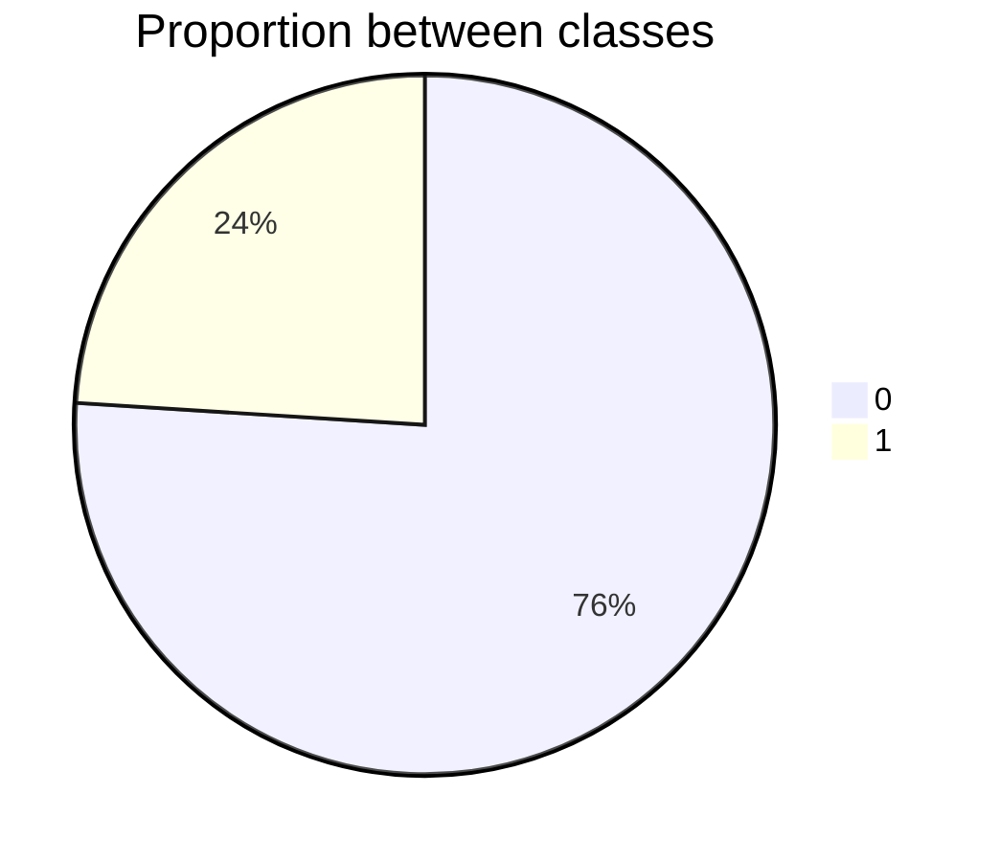
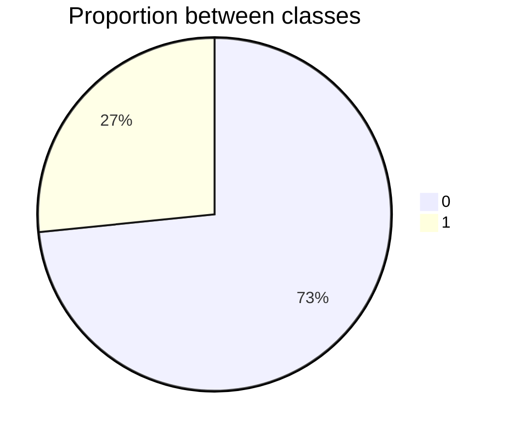

# Depression Analysis Classifier

## Overview
The **Depression Analysis Classifier** is a machine learning tool designed to predict signs of depression from text data. It uses Transformer-based models, such as BERT, to analyze language and classify texts, with the goal of contributing to mental health initiatives by offering an automated method to detect potential symptoms of depression.

## Features
- **BERT-Based Classification**: The system relies on the BERT encoder to understand and classify text, taking advantage of modern advances in pre-trained language models.
- **Customizable Hyperparameters**: Allows adjustment of key parameters such as learning rate to improve model performance.
- **Integration with Audio Transcription**: Includes the ability to transcribe audio responses for text analysis if needed.

## Installation
To set up the project, follow these steps:

### Prerequisites
1. Make sure you have **Python 3.6+** installed on your system.
2. Install the dependencies specified in the `requirements.txt` file with the command:

   ```bash
   pip install -r requirements.txt
   ```
3. If you want to use a configuration with a GPU you have to check on the pytorch site how to do it properly given the different versions

Otherwise, for a configuration without GPU, use the following command:

```bash
pip3 install torch torchvision torchaudio
```

If it doesn't work you should probably check on https://pytorch.org/get-started/locally/.

# Confidence Report

**The Threshold for a well-balanced database is fixed to `10.0%`***.
    The first confidence value refers to the confidence related to the individual transcription, which is the minimum confidence threshold for the individual timestamps within the transcription.*
The second confidence value refers to the minimum average confidence for the individual file to be considered in the final CSV.*


> [!WARNING]
> No one of the *227* `.csv` files reached the minimum threshold to appear inside this box. 
> The actual Treshold had been set to `10.0%` and the highest balancing database can be found setting the threshold to **`24.0%`**.

## Binary dataset single and all files 0.08 0.08.

- ❌ **UNBALANCED** - `24.0%` for the minority class.
- **Confidence**:
  **Path**: `data\filtered_positive_csv\all_files_confidence\binary_dataset_single_and_all_files_0.08_0.08.csv`.
- **Trascription Confidence**: `0.08`
- **Files Confidence**: `0.08`


| Class | Number of examples | Proportion |
| ----- | ------------------ | ---------- |
| `0`   | `209`              | `0.76`     |
| `1`   | `66`               | `0.24`     |




## Binary dataset single and all files 0.08 0.13.

- ❌ **UNBALANCED** - `24.0%` for the minority class.
- **Confidence**:
  **Path**: `data\filtered_positive_csv\all_files_confidence\binary_dataset_single_and_all_files_0.08_0.13.csv`.
- **Trascription Confidence**: `0.08`
- **Files Confidence**: `0.13`


| Class | Number of examples | Proportion |
| ----- | ------------------ | ---------- |
| `0`   | `209`              | `0.76`     |
| `1`   | `66`               | `0.24`     |


## Binary dataset single and all files 0.08 0.18.

- ❌ **UNBALANCED** - `24.0%` for the minority class.
- **Confidence**:
  **Path**: `data\filtered_positive_csv\all_files_confidence\binary_dataset_single_and_all_files_0.08_0.18.csv`.
- **Trascription Confidence**: `0.08`
- **Files Confidence**: `0.18`


| Class | Number of examples | Proportion |
| ----- | ------------------ | ---------- |
| `0`   | `209`              | `0.76`     |
| `1`   | `66`               | `0.24`     |


## Binary dataset single and all files 0.08 0.23.

- ❌ **UNBALANCED** - `24.0%` for the minority class.
- **Confidence**:
  **Path**: `data\filtered_positive_csv\all_files_confidence\binary_dataset_single_and_all_files_0.08_0.23.csv`.
- **Trascription Confidence**: `0.08`
- **Files Confidence**: `0.23`


| Class | Number of examples | Proportion |
| ----- | ------------------ | ---------- |
| `0`   | `209`              | `0.76`     |
| `1`   | `66`               | `0.24`     |


## Binary dataset single and all files 0.08 0.28.

- ❌ **UNBALANCED** - `24.0%` for the minority class.
- **Confidence**:
  **Path**: `data\filtered_positive_csv\all_files_confidence\binary_dataset_single_and_all_files_0.08_0.28.csv`.
- **Trascription Confidence**: `0.08`
- **Files Confidence**: `0.28`


| Class | Number of examples | Proportion |
| ----- | ------------------ | ---------- |
| `0`   | `209`              | `0.76`     |
| `1`   | `66`               | `0.24`     |


## Binary dataset single and all files 0.08 0.33.

- ❌ **UNBALANCED** - `24.0%` for the minority class.
- **Confidence**:
  **Path**: `data\filtered_positive_csv\all_files_confidence\binary_dataset_single_and_all_files_0.08_0.33.csv`.
- **Trascription Confidence**: `0.08`
- **Files Confidence**: `0.33`


| Class | Number of examples | Proportion |
| ----- | ------------------ | ---------- |
| `0`   | `209`              | `0.76`     |
| `1`   | `66`               | `0.24`     |


## Binary dataset single and all files 0.08 0.38.

- ❌ **UNBALANCED** - `24.0%` for the minority class.
- **Confidence**:
  **Path**: `data\filtered_positive_csv\all_files_confidence\binary_dataset_single_and_all_files_0.08_0.38.csv`.
- **Trascription Confidence**: `0.08`
- **Files Confidence**: `0.38`


| Class | Number of examples | Proportion |
| ----- | ------------------ | ---------- |
| `0`   | `209`              | `0.76`     |
| `1`   | `66`               | `0.24`     |


## Binary dataset single and all files 0.08 0.43.

- ❌ **UNBALANCED** - `24.0%` for the minority class.
- **Confidence**:
  **Path**: `data\filtered_positive_csv\all_files_confidence\binary_dataset_single_and_all_files_0.08_0.43.csv`.
- **Trascription Confidence**: `0.08`
- **Files Confidence**: `0.43`


| Class | Number of examples | Proportion |
| ----- | ------------------ | ---------- |
| `0`   | `209`              | `0.76`     |
| `1`   | `66`               | `0.24`     |


## Binary dataset single and all files 0.08 0.48.

- ❌ **UNBALANCED** - `24.0%` for the minority class.
- **Confidence**:
  **Path**: `data\filtered_positive_csv\all_files_confidence\binary_dataset_single_and_all_files_0.08_0.48.csv`.
- **Trascription Confidence**: `0.08`
- **Files Confidence**: `0.48`


| Class | Number of examples | Proportion |
| ----- | ------------------ | ---------- |
| `0`   | `209`              | `0.76`     |
| `1`   | `66`               | `0.24`     |


## Binary dataset single and all files 0.08 0.53.

- ❌ **UNBALANCED** - `24.0%` for the minority class.
- **Confidence**:
  **Path**: `data\filtered_positive_csv\all_files_confidence\binary_dataset_single_and_all_files_0.08_0.53.csv`.
- **Trascription Confidence**: `0.08`
- **Files Confidence**: `0.53`


| Class | Number of examples | Proportion |
| ----- | ------------------ | ---------- |
| `0`   | `209`              | `0.76`     |
| `1`   | `66`               | `0.24`     |


## Binary dataset single and all files 0.08 0.58.

- ❌ **UNBALANCED** - `24.0%` for the minority class.
- **Confidence**:
  **Path**: `data\filtered_positive_csv\all_files_confidence\binary_dataset_single_and_all_files_0.08_0.58.csv`.
- **Trascription Confidence**: `0.08`
- **Files Confidence**: `0.58`


| Class | Number of examples | Proportion |
| ----- | ------------------ | ---------- |
| `0`   | `209`              | `0.76`     |
| `1`   | `66`               | `0.24`     |


## Binary dataset single and all files 0.08 0.63.

- ❌ **UNBALANCED** - `24.0%` for the minority class.
- **Confidence**:
  **Path**: `data\filtered_positive_csv\all_files_confidence\binary_dataset_single_and_all_files_0.08_0.63.csv`.
- **Trascription Confidence**: `0.08`
- **Files Confidence**: `0.63`


| Class | Number of examples | Proportion |
| ----- | ------------------ | ---------- |
| `0`   | `209`              | `0.76`     |
| `1`   | `66`               | `0.24`     |


## Binary dataset single and all files 0.08 0.68.

- ❌ **UNBALANCED** - `24.0%` for the minority class.
- **Confidence**:
  **Path**: `data\filtered_positive_csv\all_files_confidence\binary_dataset_single_and_all_files_0.08_0.68.csv`.
- **Trascription Confidence**: `0.08`
- **Files Confidence**: `0.68`


| Class | Number of examples | Proportion |
| ----- | ------------------ | ---------- |
| `0`   | `209`              | `0.76`     |
| `1`   | `66`               | `0.24`     |


## Binary dataset single and all files 0.08 0.73.

- ❌ **UNBALANCED** - `24.0%` for the minority class.
- **Confidence**:
  **Path**: `data\filtered_positive_csv\all_files_confidence\binary_dataset_single_and_all_files_0.08_0.73.csv`.
- **Trascription Confidence**: `0.08`
- **Files Confidence**: `0.73`


| Class | Number of examples | Proportion |
| ----- | ------------------ | ---------- |
| `0`   | `209`              | `0.76`     |
| `1`   | `66`               | `0.24`     |


## Binary dataset single and all files 0.08 0.78.

- ❌ **UNBALANCED** - `24.0%` for the minority class.
- **Confidence**:
  **Path**: `data\filtered_positive_csv\all_files_confidence\binary_dataset_single_and_all_files_0.08_0.78.csv`.
- **Trascription Confidence**: `0.08`
- **Files Confidence**: `0.78`


| Class | Number of examples | Proportion |
| ----- | ------------------ | ---------- |
| `0`   | `209`              | `0.76`     |
| `1`   | `66`               | `0.24`     |


## Binary dataset single and all files 0.08 0.83.

- ❌ **UNBALANCED** - `24.0%` for the minority class.
- **Confidence**:
  **Path**: `data\filtered_positive_csv\all_files_confidence\binary_dataset_single_and_all_files_0.08_0.83.csv`.
- **Trascription Confidence**: `0.08`
- **Files Confidence**: `0.83`


| Class | Number of examples | Proportion |
| ----- | ------------------ | ---------- |
| `0`   | `209`              | `0.76`     |
| `1`   | `66`               | `0.24`     |


## Binary dataset single and all files 0.08 0.88.

- ❌ **UNBALANCED** - `24.0%` for the minority class.
- **Confidence**:
  **Path**: `data\filtered_positive_csv\all_files_confidence\binary_dataset_single_and_all_files_0.08_0.88.csv`.
- **Trascription Confidence**: `0.08`
- **Files Confidence**: `0.88`


| Class | Number of examples | Proportion |
| ----- | ------------------ | ---------- |
| `0`   | `209`              | `0.76`     |
| `1`   | `66`               | `0.24`     |


## Binary dataset single and all files 0.08 0.93.

- ❌ **UNBALANCED** - `24.0%` for the minority class.
- **Confidence**:
  **Path**: `data\filtered_positive_csv\all_files_confidence\binary_dataset_single_and_all_files_0.08_0.93.csv`.
- **Trascription Confidence**: `0.08`
- **Files Confidence**: `0.93`


| Class | Number of examples | Proportion |
| ----- | ------------------ | ---------- |
| `0`   | `207`              | `0.76`     |
| `1`   | `66`               | `0.24`     |


## Binary dataset single and all files 0.08 0.98.

- ❌ **UNBALANCED** - `27.0%` for the minority class.
- **Confidence**:
  **Path**: `data\filtered_positive_csv\all_files_confidence\binary_dataset_single_and_all_files_0.08_0.98.csv`.
- **Trascription Confidence**: `0.08`
- **Files Confidence**: `0.98`


| Class | Number of examples | Proportion |
| ----- | ------------------ | ---------- |
| `0`   | `80`               | `0.73`     |
| `1`   | `29`               | `0.27`     |




## Binary dataset single and all files 0.13 0.13.

- ❌ **UNBALANCED** - `24.0%` for the minority class.
- **Confidence**:
  **Path**: `data\filtered_positive_csv\all_files_confidence\binary_dataset_single_and_all_files_0.13_0.13.csv`.
- **Trascription Confidence**: `0.13`
- **Files Confidence**: `0.13`


| Class | Number of examples | Proportion |
| ----- | ------------------ | ---------- |
| `0`   | `209`              | `0.76`     |
| `1`   | `66`               | `0.24`     |


## Binary dataset single and all files 0.13 0.18.

- ❌ **UNBALANCED** - `24.0%` for the minority class.
- **Confidence**:
  **Path**: `data\filtered_positive_csv\all_files_confidence\binary_dataset_single_and_all_files_0.13_0.18.csv`.
- **Trascription Confidence**: `0.13`
- **Files Confidence**: `0.18`


| Class | Number of examples | Proportion |
| ----- | ------------------ | ---------- |
| `0`   | `209`              | `0.76`     |
| `1`   | `66`               | `0.24`     |

```mermaid
pie
    title Proportion between classes
    "0": 209
    "1": 66
```


## Binary dataset single and all files 0.13 0.23.

- ❌ **UNBALANCED** - `24.0%` for the minority class.
- **Confidence**:
  **Path**: `data\filtered_positive_csv\all_files_confidence\binary_dataset_single_and_all_files_0.13_0.23.csv`.
- **Trascription Confidence**: `0.13`
- **Files Confidence**: `0.23`


| Class | Number of examples | Proportion |
| ----- | ------------------ | ---------- |
| `0`   | `209`              | `0.76`     |
| `1`   | `66`               | `0.24`     |

```mermaid
pie
    title Proportion between classes
    "0": 209
    "1": 66
```


## Binary dataset single and all files 0.13 0.28.

- ❌ **UNBALANCED** - `24.0%` for the minority class.
- **Confidence**:
  **Path**: `data\filtered_positive_csv\all_files_confidence\binary_dataset_single_and_all_files_0.13_0.28.csv`.
- **Trascription Confidence**: `0.13`
- **Files Confidence**: `0.28`


| Class | Number of examples | Proportion |
| ----- | ------------------ | ---------- |
| `0`   | `209`              | `0.76`     |
| `1`   | `66`               | `0.24`     |

```mermaid
pie
    title Proportion between classes
    "0": 209
    "1": 66
```


## Binary dataset single and all files 0.13 0.33.

- ❌ **UNBALANCED** - `24.0%` for the minority class.
- **Confidence**:
  **Path**: `data\filtered_positive_csv\all_files_confidence\binary_dataset_single_and_all_files_0.13_0.33.csv`.
- **Trascription Confidence**: `0.13`
- **Files Confidence**: `0.33`


| Class | Number of examples | Proportion |
| ----- | ------------------ | ---------- |
| `0`   | `209`              | `0.76`     |
| `1`   | `66`               | `0.24`     |

```mermaid
pie
    title Proportion between classes
    "0": 209
    "1": 66
```


## Binary dataset single and all files 0.13 0.38.

- ❌ **UNBALANCED** - `24.0%` for the minority class.
- **Confidence**:
  **Path**: `data\filtered_positive_csv\all_files_confidence\binary_dataset_single_and_all_files_0.13_0.38.csv`.
- **Trascription Confidence**: `0.13`
- **Files Confidence**: `0.38`


| Class | Number of examples | Proportion |
| ----- | ------------------ | ---------- |
| `0`   | `209`              | `0.76`     |
| `1`   | `66`               | `0.24`     |

```mermaid
pie
    title Proportion between classes
    "0": 209
    "1": 66
```


## Binary dataset single and all files 0.13 0.43.

- ❌ **UNBALANCED** - `24.0%` for the minority class.
- **Confidence**:
  **Path**: `data\filtered_positive_csv\all_files_confidence\binary_dataset_single_and_all_files_0.13_0.43.csv`.
- **Trascription Confidence**: `0.13`
- **Files Confidence**: `0.43`


| Class | Number of examples | Proportion |
| ----- | ------------------ | ---------- |
| `0`   | `209`              | `0.76`     |
| `1`   | `66`               | `0.24`     |

```mermaid
pie
    title Proportion between classes
    "0": 209
    "1": 66
```


## Binary dataset single and all files 0.13 0.48.

- ❌ **UNBALANCED** - `24.0%` for the minority class.
- **Confidence**:
  **Path**: `data\filtered_positive_csv\all_files_confidence\binary_dataset_single_and_all_files_0.13_0.48.csv`.
- **Trascription Confidence**: `0.13`
- **Files Confidence**: `0.48`


| Class | Number of examples | Proportion |
| ----- | ------------------ | ---------- |
| `0`   | `209`              | `0.76`     |
| `1`   | `66`               | `0.24`     |

```mermaid
pie
    title Proportion between classes
    "0": 209
    "1": 66
```


## Binary dataset single and all files 0.13 0.53.

- ❌ **UNBALANCED** - `24.0%` for the minority class.
- **Confidence**:
  **Path**: `data\filtered_positive_csv\all_files_confidence\binary_dataset_single_and_all_files_0.13_0.53.csv`.
- **Trascription Confidence**: `0.13`
- **Files Confidence**: `0.53`


| Class | Number of examples | Proportion |
| ----- | ------------------ | ---------- |
| `0`   | `209`              | `0.76`     |
| `1`   | `66`               | `0.24`     |

```mermaid
pie
    title Proportion between classes
    "0": 209
    "1": 66
```


## Binary dataset single and all files 0.13 0.58.

- ❌ **UNBALANCED** - `24.0%` for the minority class.
- **Confidence**:
  **Path**: `data\filtered_positive_csv\all_files_confidence\binary_dataset_single_and_all_files_0.13_0.58.csv`.
- **Trascription Confidence**: `0.13`
- **Files Confidence**: `0.58`


| Class | Number of examples | Proportion |
| ----- | ------------------ | ---------- |
| `0`   | `209`              | `0.76`     |
| `1`   | `66`               | `0.24`     |

```mermaid
pie
    title Proportion between classes
    "0": 209
    "1": 66
```


## Binary dataset single and all files 0.13 0.63.

- ❌ **UNBALANCED** - `24.0%` for the minority class.
- **Confidence**:
  **Path**: `data\filtered_positive_csv\all_files_confidence\binary_dataset_single_and_all_files_0.13_0.63.csv`.
- **Trascription Confidence**: `0.13`
- **Files Confidence**: `0.63`


| Class | Number of examples | Proportion |
| ----- | ------------------ | ---------- |
| `0`   | `209`              | `0.76`     |
| `1`   | `66`               | `0.24`     |

```mermaid
pie
    title Proportion between classes
    "0": 209
    "1": 66
```


## Binary dataset single and all files 0.13 0.68.

- ❌ **UNBALANCED** - `24.0%` for the minority class.
- **Confidence**:
  **Path**: `data\filtered_positive_csv\all_files_confidence\binary_dataset_single_and_all_files_0.13_0.68.csv`.
- **Trascription Confidence**: `0.13`
- **Files Confidence**: `0.68`


| Class | Number of examples | Proportion |
| ----- | ------------------ | ---------- |
| `0`   | `209`              | `0.76`     |
| `1`   | `66`               | `0.24`     |

```mermaid
pie
    title Proportion between classes
    "0": 209
    "1": 66
```


## Binary dataset single and all files 0.13 0.73.

- ❌ **UNBALANCED** - `24.0%` for the minority class.
- **Confidence**:
  **Path**: `data\filtered_positive_csv\all_files_confidence\binary_dataset_single_and_all_files_0.13_0.73.csv`.
- **Trascription Confidence**: `0.13`
- **Files Confidence**: `0.73`


| Class | Number of examples | Proportion |
| ----- | ------------------ | ---------- |
| `0`   | `209`              | `0.76`     |
| `1`   | `66`               | `0.24`     |

```mermaid
pie
    title Proportion between classes
    "0": 209
    "1": 66
```


## Binary dataset single and all files 0.13 0.78.

- ❌ **UNBALANCED** - `24.0%` for the minority class.
- **Confidence**:
  **Path**: `data\filtered_positive_csv\all_files_confidence\binary_dataset_single_and_all_files_0.13_0.78.csv`.
- **Trascription Confidence**: `0.13`
- **Files Confidence**: `0.78`


| Class | Number of examples | Proportion |
| ----- | ------------------ | ---------- |
| `0`   | `209`              | `0.76`     |
| `1`   | `66`               | `0.24`     |

```mermaid
pie
    title Proportion between classes
    "0": 209
    "1": 66
```


## Binary dataset single and all files 0.13 0.83.

- ❌ **UNBALANCED** - `24.0%` for the minority class.
- **Confidence**:
  **Path**: `data\filtered_positive_csv\all_files_confidence\binary_dataset_single_and_all_files_0.13_0.83.csv`.
- **Trascription Confidence**: `0.13`
- **Files Confidence**: `0.83`


| Class | Number of examples | Proportion |
| ----- | ------------------ | ---------- |
| `0`   | `209`              | `0.76`     |
| `1`   | `66`               | `0.24`     |

```mermaid
pie
    title Proportion between classes
    "0": 209
    "1": 66
```


## Binary dataset single and all files 0.13 0.88.

- ❌ **UNBALANCED** - `24.0%` for the minority class.
- **Confidence**:
  **Path**: `data\filtered_positive_csv\all_files_confidence\binary_dataset_single_and_all_files_0.13_0.88.csv`.
- **Trascription Confidence**: `0.13`
- **Files Confidence**: `0.88`


| Class | Number of examples | Proportion |
| ----- | ------------------ | ---------- |
| `0`   | `209`              | `0.76`     |
| `1`   | `66`               | `0.24`     |

```mermaid
pie
    title Proportion between classes
    "0": 209
    "1": 66
```


## Binary dataset single and all files 0.13 0.93.

- ❌ **UNBALANCED** - `24.0%` for the minority class.
- **Confidence**:
  **Path**: `data\filtered_positive_csv\all_files_confidence\binary_dataset_single_and_all_files_0.13_0.93.csv`.
- **Trascription Confidence**: `0.13`
- **Files Confidence**: `0.93`


| Class | Number of examples | Proportion |
| ----- | ------------------ | ---------- |
| `0`   | `207`              | `0.76`     |
| `1`   | `66`               | `0.24`     |

```mermaid
pie
    title Proportion between classes
    "0": 207
    "1": 66
```


## Binary dataset single and all files 0.13 0.98.

- ❌ **UNBALANCED** - `27.0%` for the minority class.
- **Confidence**:
  **Path**: `data\filtered_positive_csv\all_files_confidence\binary_dataset_single_and_all_files_0.13_0.98.csv`.
- **Trascription Confidence**: `0.13`
- **Files Confidence**: `0.98`


| Class | Number of examples | Proportion |
| ----- | ------------------ | ---------- |
| `0`   | `80`               | `0.73`     |
| `1`   | `29`               | `0.27`     |

```mermaid
pie
    title Proportion between classes
    "0": 80
    "1": 29
```


## Binary dataset single and all files 0.18 0.18.

- ❌ **UNBALANCED** - `24.0%` for the minority class.
- **Confidence**:
  **Path**: `data\filtered_positive_csv\all_files_confidence\binary_dataset_single_and_all_files_0.18_0.18.csv`.
- **Trascription Confidence**: `0.18`
- **Files Confidence**: `0.18`


| Class | Number of examples | Proportion |
| ----- | ------------------ | ---------- |
| `0`   | `209`              | `0.76`     |
| `1`   | `66`               | `0.24`     |

```mermaid
pie
    title Proportion between classes
    "0": 209
    "1": 66
```


## Binary dataset single and all files 0.18 0.23.

- ❌ **UNBALANCED** - `24.0%` for the minority class.
- **Confidence**:
  **Path**: `data\filtered_positive_csv\all_files_confidence\binary_dataset_single_and_all_files_0.18_0.23.csv`.
- **Trascription Confidence**: `0.18`
- **Files Confidence**: `0.23`


| Class | Number of examples | Proportion |
| ----- | ------------------ | ---------- |
| `0`   | `209`              | `0.76`     |
| `1`   | `66`               | `0.24`     |

```mermaid
pie
    title Proportion between classes
    "0": 209
    "1": 66
```


## Binary dataset single and all files 0.18 0.28.

- ❌ **UNBALANCED** - `24.0%` for the minority class.
- **Confidence**:
  **Path**: `data\filtered_positive_csv\all_files_confidence\binary_dataset_single_and_all_files_0.18_0.28.csv`.
- **Trascription Confidence**: `0.18`
- **Files Confidence**: `0.28`


| Class | Number of examples | Proportion |
| ----- | ------------------ | ---------- |
| `0`   | `209`              | `0.76`     |
| `1`   | `66`               | `0.24`     |

```mermaid
pie
    title Proportion between classes
    "0": 209
    "1": 66
```


## Binary dataset single and all files 0.18 0.33.

- ❌ **UNBALANCED** - `24.0%` for the minority class.
- **Confidence**:
  **Path**: `data\filtered_positive_csv\all_files_confidence\binary_dataset_single_and_all_files_0.18_0.33.csv`.
- **Trascription Confidence**: `0.18`
- **Files Confidence**: `0.33`


| Class | Number of examples | Proportion |
| ----- | ------------------ | ---------- |
| `0`   | `209`              | `0.76`     |
| `1`   | `66`               | `0.24`     |

```mermaid
pie
    title Proportion between classes
    "0": 209
    "1": 66
```


## Binary dataset single and all files 0.18 0.38.

- ❌ **UNBALANCED** - `24.0%` for the minority class.
- **Confidence**:
  **Path**: `data\filtered_positive_csv\all_files_confidence\binary_dataset_single_and_all_files_0.18_0.38.csv`.
- **Trascription Confidence**: `0.18`
- **Files Confidence**: `0.38`


| Class | Number of examples | Proportion |
| ----- | ------------------ | ---------- |
| `0`   | `209`              | `0.76`     |
| `1`   | `66`               | `0.24`     |

```mermaid
pie
    title Proportion between classes
    "0": 209
    "1": 66
```


## Binary dataset single and all files 0.18 0.43.

- ❌ **UNBALANCED** - `24.0%` for the minority class.
- **Confidence**:
  **Path**: `data\filtered_positive_csv\all_files_confidence\binary_dataset_single_and_all_files_0.18_0.43.csv`.
- **Trascription Confidence**: `0.18`
- **Files Confidence**: `0.43`


| Class | Number of examples | Proportion |
| ----- | ------------------ | ---------- |
| `0`   | `209`              | `0.76`     |
| `1`   | `66`               | `0.24`     |

```mermaid
pie
    title Proportion between classes
    "0": 209
    "1": 66
```


## Binary dataset single and all files 0.18 0.48.

- ❌ **UNBALANCED** - `24.0%` for the minority class.
- **Confidence**:
  **Path**: `data\filtered_positive_csv\all_files_confidence\binary_dataset_single_and_all_files_0.18_0.48.csv`.
- **Trascription Confidence**: `0.18`
- **Files Confidence**: `0.48`


| Class | Number of examples | Proportion |
| ----- | ------------------ | ---------- |
| `0`   | `209`              | `0.76`     |
| `1`   | `66`               | `0.24`     |

```mermaid
pie
    title Proportion between classes
    "0": 209
    "1": 66
```


## Binary dataset single and all files 0.18 0.53.

- ❌ **UNBALANCED** - `24.0%` for the minority class.
- **Confidence**:
  **Path**: `data\filtered_positive_csv\all_files_confidence\binary_dataset_single_and_all_files_0.18_0.53.csv`.
- **Trascription Confidence**: `0.18`
- **Files Confidence**: `0.53`


| Class | Number of examples | Proportion |
| ----- | ------------------ | ---------- |
| `0`   | `209`              | `0.76`     |
| `1`   | `66`               | `0.24`     |

```mermaid
pie
    title Proportion between classes
    "0": 209
    "1": 66
```


## Binary dataset single and all files 0.18 0.58.

- ❌ **UNBALANCED** - `24.0%` for the minority class.
- **Confidence**:
  **Path**: `data\filtered_positive_csv\all_files_confidence\binary_dataset_single_and_all_files_0.18_0.58.csv`.
- **Trascription Confidence**: `0.18`
- **Files Confidence**: `0.58`


| Class | Number of examples | Proportion |
| ----- | ------------------ | ---------- |
| `0`   | `209`              | `0.76`     |
| `1`   | `66`               | `0.24`     |

```mermaid
pie
    title Proportion between classes
    "0": 209
    "1": 66
```


## Binary dataset single and all files 0.18 0.63.

- ❌ **UNBALANCED** - `24.0%` for the minority class.
- **Confidence**:
  **Path**: `data\filtered_positive_csv\all_files_confidence\binary_dataset_single_and_all_files_0.18_0.63.csv`.
- **Trascription Confidence**: `0.18`
- **Files Confidence**: `0.63`


| Class | Number of examples | Proportion |
| ----- | ------------------ | ---------- |
| `0`   | `209`              | `0.76`     |
| `1`   | `66`               | `0.24`     |

```mermaid
pie
    title Proportion between classes
    "0": 209
    "1": 66
```


## Binary dataset single and all files 0.18 0.68.

- ❌ **UNBALANCED** - `24.0%` for the minority class.
- **Confidence**:
  **Path**: `data\filtered_positive_csv\all_files_confidence\binary_dataset_single_and_all_files_0.18_0.68.csv`.
- **Trascription Confidence**: `0.18`
- **Files Confidence**: `0.68`


| Class | Number of examples | Proportion |
| ----- | ------------------ | ---------- |
| `0`   | `209`              | `0.76`     |
| `1`   | `66`               | `0.24`     |

```mermaid
pie
    title Proportion between classes
    "0": 209
    "1": 66
```


## Binary dataset single and all files 0.18 0.73.

- ❌ **UNBALANCED** - `24.0%` for the minority class.
- **Confidence**:
  **Path**: `data\filtered_positive_csv\all_files_confidence\binary_dataset_single_and_all_files_0.18_0.73.csv`.
- **Trascription Confidence**: `0.18`
- **Files Confidence**: `0.73`


| Class | Number of examples | Proportion |
| ----- | ------------------ | ---------- |
| `0`   | `209`              | `0.76`     |
| `1`   | `66`               | `0.24`     |

```mermaid
pie
    title Proportion between classes
    "0": 209
    "1": 66
```


## Binary dataset single and all files 0.18 0.78.

- ❌ **UNBALANCED** - `24.0%` for the minority class.
- **Confidence**:
  **Path**: `data\filtered_positive_csv\all_files_confidence\binary_dataset_single_and_all_files_0.18_0.78.csv`.
- **Trascription Confidence**: `0.18`
- **Files Confidence**: `0.78`


| Class | Number of examples | Proportion |
| ----- | ------------------ | ---------- |
| `0`   | `209`              | `0.76`     |
| `1`   | `66`               | `0.24`     |

```mermaid
pie
    title Proportion between classes
    "0": 209
    "1": 66
```


## Binary dataset single and all files 0.18 0.83.

- ❌ **UNBALANCED** - `24.0%` for the minority class.
- **Confidence**:
  **Path**: `data\filtered_positive_csv\all_files_confidence\binary_dataset_single_and_all_files_0.18_0.83.csv`.
- **Trascription Confidence**: `0.18`
- **Files Confidence**: `0.83`


| Class | Number of examples | Proportion |
| ----- | ------------------ | ---------- |
| `0`   | `209`              | `0.76`     |
| `1`   | `66`               | `0.24`     |

```mermaid
pie
    title Proportion between classes
    "0": 209
    "1": 66
```


## Binary dataset single and all files 0.18 0.88.

- ❌ **UNBALANCED** - `24.0%` for the minority class.
- **Confidence**:
  **Path**: `data\filtered_positive_csv\all_files_confidence\binary_dataset_single_and_all_files_0.18_0.88.csv`.
- **Trascription Confidence**: `0.18`
- **Files Confidence**: `0.88`


| Class | Number of examples | Proportion |
| ----- | ------------------ | ---------- |
| `0`   | `209`              | `0.76`     |
| `1`   | `66`               | `0.24`     |

```mermaid
pie
    title Proportion between classes
    "0": 209
    "1": 66
```


## Binary dataset single and all files 0.18 0.93.

- ❌ **UNBALANCED** - `24.0%` for the minority class.
- **Confidence**:
  **Path**: `data\filtered_positive_csv\all_files_confidence\binary_dataset_single_and_all_files_0.18_0.93.csv`.
- **Trascription Confidence**: `0.18`
- **Files Confidence**: `0.93`


| Class | Number of examples | Proportion |
| ----- | ------------------ | ---------- |
| `0`   | `207`              | `0.76`     |
| `1`   | `66`               | `0.24`     |

```mermaid
pie
    title Proportion between classes
    "0": 207
    "1": 66
```


## Binary dataset single and all files 0.18 0.98.

- ❌ **UNBALANCED** - `27.0%` for the minority class.
- **Confidence**:
  **Path**: `data\filtered_positive_csv\all_files_confidence\binary_dataset_single_and_all_files_0.18_0.98.csv`.
- **Trascription Confidence**: `0.18`
- **Files Confidence**: `0.98`


| Class | Number of examples | Proportion |
| ----- | ------------------ | ---------- |
| `0`   | `80`               | `0.73`     |
| `1`   | `29`               | `0.27`     |

```mermaid
pie
    title Proportion between classes
    "0": 80
    "1": 29
```


## Binary dataset single and all files 0.23 0.23.

- ❌ **UNBALANCED** - `24.0%` for the minority class.
- **Confidence**:
  **Path**: `data\filtered_positive_csv\all_files_confidence\binary_dataset_single_and_all_files_0.23_0.23.csv`.
- **Trascription Confidence**: `0.23`
- **Files Confidence**: `0.23`


| Class | Number of examples | Proportion |
| ----- | ------------------ | ---------- |
| `0`   | `209`              | `0.76`     |
| `1`   | `66`               | `0.24`     |

```mermaid
pie
    title Proportion between classes
    "0": 209
    "1": 66
```


## Binary dataset single and all files 0.23 0.28.

- ❌ **UNBALANCED** - `24.0%` for the minority class.
- **Confidence**:
  **Path**: `data\filtered_positive_csv\all_files_confidence\binary_dataset_single_and_all_files_0.23_0.28.csv`.
- **Trascription Confidence**: `0.23`
- **Files Confidence**: `0.28`


| Class | Number of examples | Proportion |
| ----- | ------------------ | ---------- |
| `0`   | `209`              | `0.76`     |
| `1`   | `66`               | `0.24`     |

```mermaid
pie
    title Proportion between classes
    "0": 209
    "1": 66
```


## Binary dataset single and all files 0.23 0.33.

- ❌ **UNBALANCED** - `24.0%` for the minority class.
- **Confidence**:
  **Path**: `data\filtered_positive_csv\all_files_confidence\binary_dataset_single_and_all_files_0.23_0.33.csv`.
- **Trascription Confidence**: `0.23`
- **Files Confidence**: `0.33`


| Class | Number of examples | Proportion |
| ----- | ------------------ | ---------- |
| `0`   | `209`              | `0.76`     |
| `1`   | `66`               | `0.24`     |

```mermaid
pie
    title Proportion between classes
    "0": 209
    "1": 66
```


## Binary dataset single and all files 0.23 0.38.

- ❌ **UNBALANCED** - `24.0%` for the minority class.
- **Confidence**:
  **Path**: `data\filtered_positive_csv\all_files_confidence\binary_dataset_single_and_all_files_0.23_0.38.csv`.
- **Trascription Confidence**: `0.23`
- **Files Confidence**: `0.38`


| Class | Number of examples | Proportion |
| ----- | ------------------ | ---------- |
| `0`   | `209`              | `0.76`     |
| `1`   | `66`               | `0.24`     |

```mermaid
pie
    title Proportion between classes
    "0": 209
    "1": 66
```


## Binary dataset single and all files 0.23 0.43.

- ❌ **UNBALANCED** - `24.0%` for the minority class.
- **Confidence**:
  **Path**: `data\filtered_positive_csv\all_files_confidence\binary_dataset_single_and_all_files_0.23_0.43.csv`.
- **Trascription Confidence**: `0.23`
- **Files Confidence**: `0.43`


| Class | Number of examples | Proportion |
| ----- | ------------------ | ---------- |
| `0`   | `209`              | `0.76`     |
| `1`   | `66`               | `0.24`     |

```mermaid
pie
    title Proportion between classes
    "0": 209
    "1": 66
```


## Binary dataset single and all files 0.23 0.48.

- ❌ **UNBALANCED** - `24.0%` for the minority class.
- **Confidence**:
  **Path**: `data\filtered_positive_csv\all_files_confidence\binary_dataset_single_and_all_files_0.23_0.48.csv`.
- **Trascription Confidence**: `0.23`
- **Files Confidence**: `0.48`


| Class | Number of examples | Proportion |
| ----- | ------------------ | ---------- |
| `0`   | `209`              | `0.76`     |
| `1`   | `66`               | `0.24`     |

```mermaid
pie
    title Proportion between classes
    "0": 209
    "1": 66
```


## Binary dataset single and all files 0.23 0.53.

- ❌ **UNBALANCED** - `24.0%` for the minority class.
- **Confidence**:
  **Path**: `data\filtered_positive_csv\all_files_confidence\binary_dataset_single_and_all_files_0.23_0.53.csv`.
- **Trascription Confidence**: `0.23`
- **Files Confidence**: `0.53`


| Class | Number of examples | Proportion |
| ----- | ------------------ | ---------- |
| `0`   | `209`              | `0.76`     |
| `1`   | `66`               | `0.24`     |

```mermaid
pie
    title Proportion between classes
    "0": 209
    "1": 66
```


## Binary dataset single and all files 0.23 0.58.

- ❌ **UNBALANCED** - `24.0%` for the minority class.
- **Confidence**:
  **Path**: `data\filtered_positive_csv\all_files_confidence\binary_dataset_single_and_all_files_0.23_0.58.csv`.
- **Trascription Confidence**: `0.23`
- **Files Confidence**: `0.58`


| Class | Number of examples | Proportion |
| ----- | ------------------ | ---------- |
| `0`   | `209`              | `0.76`     |
| `1`   | `66`               | `0.24`     |

```mermaid
pie
    title Proportion between classes
    "0": 209
    "1": 66
```


## Binary dataset single and all files 0.23 0.63.

- ❌ **UNBALANCED** - `24.0%` for the minority class.
- **Confidence**:
  **Path**: `data\filtered_positive_csv\all_files_confidence\binary_dataset_single_and_all_files_0.23_0.63.csv`.
- **Trascription Confidence**: `0.23`
- **Files Confidence**: `0.63`


| Class | Number of examples | Proportion |
| ----- | ------------------ | ---------- |
| `0`   | `209`              | `0.76`     |
| `1`   | `66`               | `0.24`     |

```mermaid
pie
    title Proportion between classes
    "0": 209
    "1": 66
```


## Binary dataset single and all files 0.23 0.68.

- ❌ **UNBALANCED** - `24.0%` for the minority class.
- **Confidence**:
  **Path**: `data\filtered_positive_csv\all_files_confidence\binary_dataset_single_and_all_files_0.23_0.68.csv`.
- **Trascription Confidence**: `0.23`
- **Files Confidence**: `0.68`


| Class | Number of examples | Proportion |
| ----- | ------------------ | ---------- |
| `0`   | `209`              | `0.76`     |
| `1`   | `66`               | `0.24`     |

```mermaid
pie
    title Proportion between classes
    "0": 209
    "1": 66
```


## Binary dataset single and all files 0.23 0.73.

- ❌ **UNBALANCED** - `24.0%` for the minority class.
- **Confidence**:
  **Path**: `data\filtered_positive_csv\all_files_confidence\binary_dataset_single_and_all_files_0.23_0.73.csv`.
- **Trascription Confidence**: `0.23`
- **Files Confidence**: `0.73`


| Class | Number of examples | Proportion |
| ----- | ------------------ | ---------- |
| `0`   | `209`              | `0.76`     |
| `1`   | `66`               | `0.24`     |

```mermaid
pie
    title Proportion between classes
    "0": 209
    "1": 66
```


## Binary dataset single and all files 0.23 0.78.

- ❌ **UNBALANCED** - `24.0%` for the minority class.
- **Confidence**:
  **Path**: `data\filtered_positive_csv\all_files_confidence\binary_dataset_single_and_all_files_0.23_0.78.csv`.
- **Trascription Confidence**: `0.23`
- **Files Confidence**: `0.78`


| Class | Number of examples | Proportion |
| ----- | ------------------ | ---------- |
| `0`   | `209`              | `0.76`     |
| `1`   | `66`               | `0.24`     |

```mermaid
pie
    title Proportion between classes
    "0": 209
    "1": 66
```


## Binary dataset single and all files 0.23 0.83.

- ❌ **UNBALANCED** - `24.0%` for the minority class.
- **Confidence**:
  **Path**: `data\filtered_positive_csv\all_files_confidence\binary_dataset_single_and_all_files_0.23_0.83.csv`.
- **Trascription Confidence**: `0.23`
- **Files Confidence**: `0.83`


| Class | Number of examples | Proportion |
| ----- | ------------------ | ---------- |
| `0`   | `209`              | `0.76`     |
| `1`   | `66`               | `0.24`     |

```mermaid
pie
    title Proportion between classes
    "0": 209
    "1": 66
```


## Binary dataset single and all files 0.23 0.88.

- ❌ **UNBALANCED** - `24.0%` for the minority class.
- **Confidence**:
  **Path**: `data\filtered_positive_csv\all_files_confidence\binary_dataset_single_and_all_files_0.23_0.88.csv`.
- **Trascription Confidence**: `0.23`
- **Files Confidence**: `0.88`


| Class | Number of examples | Proportion |
| ----- | ------------------ | ---------- |
| `0`   | `209`              | `0.76`     |
| `1`   | `66`               | `0.24`     |

```mermaid
pie
    title Proportion between classes
    "0": 209
    "1": 66
```


## Binary dataset single and all files 0.23 0.93.

- ❌ **UNBALANCED** - `24.0%` for the minority class.
- **Confidence**:
  **Path**: `data\filtered_positive_csv\all_files_confidence\binary_dataset_single_and_all_files_0.23_0.93.csv`.
- **Trascription Confidence**: `0.23`
- **Files Confidence**: `0.93`


| Class | Number of examples | Proportion |
| ----- | ------------------ | ---------- |
| `0`   | `207`              | `0.76`     |
| `1`   | `66`               | `0.24`     |

```mermaid
pie
    title Proportion between classes
    "0": 207
    "1": 66
```


## Binary dataset single and all files 0.23 0.98.

- ❌ **UNBALANCED** - `27.0%` for the minority class.
- **Confidence**:
  **Path**: `data\filtered_positive_csv\all_files_confidence\binary_dataset_single_and_all_files_0.23_0.98.csv`.
- **Trascription Confidence**: `0.23`
- **Files Confidence**: `0.98`


| Class | Number of examples | Proportion |
| ----- | ------------------ | ---------- |
| `0`   | `80`               | `0.73`     |
| `1`   | `29`               | `0.27`     |

```mermaid
pie
    title Proportion between classes
    "0": 80
    "1": 29
```


## Binary dataset single and all files 0.28 0.28.

- ❌ **UNBALANCED** - `24.0%` for the minority class.
- **Confidence**:
  **Path**: `data\filtered_positive_csv\all_files_confidence\binary_dataset_single_and_all_files_0.28_0.28.csv`.
- **Trascription Confidence**: `0.28`
- **Files Confidence**: `0.28`


| Class | Number of examples | Proportion |
| ----- | ------------------ | ---------- |
| `0`   | `209`              | `0.76`     |
| `1`   | `66`               | `0.24`     |

```mermaid
pie
    title Proportion between classes
    "0": 209
    "1": 66
```


## Binary dataset single and all files 0.28 0.33.

- ❌ **UNBALANCED** - `24.0%` for the minority class.
- **Confidence**:
  **Path**: `data\filtered_positive_csv\all_files_confidence\binary_dataset_single_and_all_files_0.28_0.33.csv`.
- **Trascription Confidence**: `0.28`
- **Files Confidence**: `0.33`


| Class | Number of examples | Proportion |
| ----- | ------------------ | ---------- |
| `0`   | `209`              | `0.76`     |
| `1`   | `66`               | `0.24`     |

```mermaid
pie
    title Proportion between classes
    "0": 209
    "1": 66
```


## Binary dataset single and all files 0.28 0.38.

- ❌ **UNBALANCED** - `24.0%` for the minority class.
- **Confidence**:
  **Path**: `data\filtered_positive_csv\all_files_confidence\binary_dataset_single_and_all_files_0.28_0.38.csv`.
- **Trascription Confidence**: `0.28`
- **Files Confidence**: `0.38`


| Class | Number of examples | Proportion |
| ----- | ------------------ | ---------- |
| `0`   | `209`              | `0.76`     |
| `1`   | `66`               | `0.24`     |

```mermaid
pie
    title Proportion between classes
    "0": 209
    "1": 66
```


## Binary dataset single and all files 0.28 0.43.

- ❌ **UNBALANCED** - `24.0%` for the minority class.
- **Confidence**:
  **Path**: `data\filtered_positive_csv\all_files_confidence\binary_dataset_single_and_all_files_0.28_0.43.csv`.
- **Trascription Confidence**: `0.28`
- **Files Confidence**: `0.43`


| Class | Number of examples | Proportion |
| ----- | ------------------ | ---------- |
| `0`   | `209`              | `0.76`     |
| `1`   | `66`               | `0.24`     |

```mermaid
pie
    title Proportion between classes
    "0": 209
    "1": 66
```


## Binary dataset single and all files 0.28 0.48.

- ❌ **UNBALANCED** - `24.0%` for the minority class.
- **Confidence**:
  **Path**: `data\filtered_positive_csv\all_files_confidence\binary_dataset_single_and_all_files_0.28_0.48.csv`.
- **Trascription Confidence**: `0.28`
- **Files Confidence**: `0.48`


| Class | Number of examples | Proportion |
| ----- | ------------------ | ---------- |
| `0`   | `209`              | `0.76`     |
| `1`   | `66`               | `0.24`     |

```mermaid
pie
    title Proportion between classes
    "0": 209
    "1": 66
```


## Binary dataset single and all files 0.28 0.53.

- ❌ **UNBALANCED** - `24.0%` for the minority class.
- **Confidence**:
  **Path**: `data\filtered_positive_csv\all_files_confidence\binary_dataset_single_and_all_files_0.28_0.53.csv`.
- **Trascription Confidence**: `0.28`
- **Files Confidence**: `0.53`


| Class | Number of examples | Proportion |
| ----- | ------------------ | ---------- |
| `0`   | `209`              | `0.76`     |
| `1`   | `66`               | `0.24`     |

```mermaid
pie
    title Proportion between classes
    "0": 209
    "1": 66
```


## Binary dataset single and all files 0.28 0.58.

- ❌ **UNBALANCED** - `24.0%` for the minority class.
- **Confidence**:
  **Path**: `data\filtered_positive_csv\all_files_confidence\binary_dataset_single_and_all_files_0.28_0.58.csv`.
- **Trascription Confidence**: `0.28`
- **Files Confidence**: `0.58`


| Class | Number of examples | Proportion |
| ----- | ------------------ | ---------- |
| `0`   | `209`              | `0.76`     |
| `1`   | `66`               | `0.24`     |

```mermaid
pie
    title Proportion between classes
    "0": 209
    "1": 66
```


## Binary dataset single and all files 0.28 0.63.

- ❌ **UNBALANCED** - `24.0%` for the minority class.
- **Confidence**:
  **Path**: `data\filtered_positive_csv\all_files_confidence\binary_dataset_single_and_all_files_0.28_0.63.csv`.
- **Trascription Confidence**: `0.28`
- **Files Confidence**: `0.63`


| Class | Number of examples | Proportion |
| ----- | ------------------ | ---------- |
| `0`   | `209`              | `0.76`     |
| `1`   | `66`               | `0.24`     |

```mermaid
pie
    title Proportion between classes
    "0": 209
    "1": 66
```


## Binary dataset single and all files 0.28 0.68.

- ❌ **UNBALANCED** - `24.0%` for the minority class.
- **Confidence**:
  **Path**: `data\filtered_positive_csv\all_files_confidence\binary_dataset_single_and_all_files_0.28_0.68.csv`.
- **Trascription Confidence**: `0.28`
- **Files Confidence**: `0.68`


| Class | Number of examples | Proportion |
| ----- | ------------------ | ---------- |
| `0`   | `209`              | `0.76`     |
| `1`   | `66`               | `0.24`     |

```mermaid
pie
    title Proportion between classes
    "0": 209
    "1": 66
```


## Binary dataset single and all files 0.28 0.73.

- ❌ **UNBALANCED** - `24.0%` for the minority class.
- **Confidence**:
  **Path**: `data\filtered_positive_csv\all_files_confidence\binary_dataset_single_and_all_files_0.28_0.73.csv`.
- **Trascription Confidence**: `0.28`
- **Files Confidence**: `0.73`


| Class | Number of examples | Proportion |
| ----- | ------------------ | ---------- |
| `0`   | `209`              | `0.76`     |
| `1`   | `66`               | `0.24`     |

```mermaid
pie
    title Proportion between classes
    "0": 209
    "1": 66
```


## Binary dataset single and all files 0.28 0.78.

- ❌ **UNBALANCED** - `24.0%` for the minority class.
- **Confidence**:
  **Path**: `data\filtered_positive_csv\all_files_confidence\binary_dataset_single_and_all_files_0.28_0.78.csv`.
- **Trascription Confidence**: `0.28`
- **Files Confidence**: `0.78`


| Class | Number of examples | Proportion |
| ----- | ------------------ | ---------- |
| `0`   | `209`              | `0.76`     |
| `1`   | `66`               | `0.24`     |

```mermaid
pie
    title Proportion between classes
    "0": 209
    "1": 66
```


## Binary dataset single and all files 0.28 0.83.

- ❌ **UNBALANCED** - `24.0%` for the minority class.
- **Confidence**:
  **Path**: `data\filtered_positive_csv\all_files_confidence\binary_dataset_single_and_all_files_0.28_0.83.csv`.
- **Trascription Confidence**: `0.28`
- **Files Confidence**: `0.83`


| Class | Number of examples | Proportion |
| ----- | ------------------ | ---------- |
| `0`   | `209`              | `0.76`     |
| `1`   | `66`               | `0.24`     |

```mermaid
pie
    title Proportion between classes
    "0": 209
    "1": 66
```


## Binary dataset single and all files 0.28 0.88.

- ❌ **UNBALANCED** - `24.0%` for the minority class.
- **Confidence**:
  **Path**: `data\filtered_positive_csv\all_files_confidence\binary_dataset_single_and_all_files_0.28_0.88.csv`.
- **Trascription Confidence**: `0.28`
- **Files Confidence**: `0.88`


| Class | Number of examples | Proportion |
| ----- | ------------------ | ---------- |
| `0`   | `209`              | `0.76`     |
| `1`   | `66`               | `0.24`     |

```mermaid
pie
    title Proportion between classes
    "0": 209
    "1": 66
```


## Binary dataset single and all files 0.28 0.93.

- ❌ **UNBALANCED** - `24.0%` for the minority class.
- **Confidence**:
  **Path**: `data\filtered_positive_csv\all_files_confidence\binary_dataset_single_and_all_files_0.28_0.93.csv`.
- **Trascription Confidence**: `0.28`
- **Files Confidence**: `0.93`


| Class | Number of examples | Proportion |
| ----- | ------------------ | ---------- |
| `0`   | `207`              | `0.76`     |
| `1`   | `66`               | `0.24`     |

```mermaid
pie
    title Proportion between classes
    "0": 207
    "1": 66
```


## Binary dataset single and all files 0.28 0.98.

- ❌ **UNBALANCED** - `27.0%` for the minority class.
- **Confidence**:
  **Path**: `data\filtered_positive_csv\all_files_confidence\binary_dataset_single_and_all_files_0.28_0.98.csv`.
- **Trascription Confidence**: `0.28`
- **Files Confidence**: `0.98`


| Class | Number of examples | Proportion |
| ----- | ------------------ | ---------- |
| `0`   | `80`               | `0.73`     |
| `1`   | `29`               | `0.27`     |

```mermaid
pie
    title Proportion between classes
    "0": 80
    "1": 29
```


## Binary dataset single and all files 0.33 0.33.

- ❌ **UNBALANCED** - `24.0%` for the minority class.
- **Confidence**:
  **Path**: `data\filtered_positive_csv\all_files_confidence\binary_dataset_single_and_all_files_0.33_0.33.csv`.
- **Trascription Confidence**: `0.33`
- **Files Confidence**: `0.33`


| Class | Number of examples | Proportion |
| ----- | ------------------ | ---------- |
| `0`   | `209`              | `0.76`     |
| `1`   | `66`               | `0.24`     |

```mermaid
pie
    title Proportion between classes
    "0": 209
    "1": 66
```


## Binary dataset single and all files 0.33 0.38.

- ❌ **UNBALANCED** - `24.0%` for the minority class.
- **Confidence**:
  **Path**: `data\filtered_positive_csv\all_files_confidence\binary_dataset_single_and_all_files_0.33_0.38.csv`.
- **Trascription Confidence**: `0.33`
- **Files Confidence**: `0.38`


| Class | Number of examples | Proportion |
| ----- | ------------------ | ---------- |
| `0`   | `209`              | `0.76`     |
| `1`   | `66`               | `0.24`     |

```mermaid
pie
    title Proportion between classes
    "0": 209
    "1": 66
```


## Binary dataset single and all files 0.33 0.43.

- ❌ **UNBALANCED** - `24.0%` for the minority class.
- **Confidence**:
  **Path**: `data\filtered_positive_csv\all_files_confidence\binary_dataset_single_and_all_files_0.33_0.43.csv`.
- **Trascription Confidence**: `0.33`
- **Files Confidence**: `0.43`


| Class | Number of examples | Proportion |
| ----- | ------------------ | ---------- |
| `0`   | `209`              | `0.76`     |
| `1`   | `66`               | `0.24`     |

```mermaid
pie
    title Proportion between classes
    "0": 209
    "1": 66
```


## Binary dataset single and all files 0.33 0.48.

- ❌ **UNBALANCED** - `24.0%` for the minority class.
- **Confidence**:
  **Path**: `data\filtered_positive_csv\all_files_confidence\binary_dataset_single_and_all_files_0.33_0.48.csv`.
- **Trascription Confidence**: `0.33`
- **Files Confidence**: `0.48`


| Class | Number of examples | Proportion |
| ----- | ------------------ | ---------- |
| `0`   | `209`              | `0.76`     |
| `1`   | `66`               | `0.24`     |

```mermaid
pie
    title Proportion between classes
    "0": 209
    "1": 66
```


## Binary dataset single and all files 0.33 0.53.

- ❌ **UNBALANCED** - `24.0%` for the minority class.
- **Confidence**:
  **Path**: `data\filtered_positive_csv\all_files_confidence\binary_dataset_single_and_all_files_0.33_0.53.csv`.
- **Trascription Confidence**: `0.33`
- **Files Confidence**: `0.53`


| Class | Number of examples | Proportion |
| ----- | ------------------ | ---------- |
| `0`   | `209`              | `0.76`     |
| `1`   | `66`               | `0.24`     |

```mermaid
pie
    title Proportion between classes
    "0": 209
    "1": 66
```


## Binary dataset single and all files 0.33 0.58.

- ❌ **UNBALANCED** - `24.0%` for the minority class.
- **Confidence**:
  **Path**: `data\filtered_positive_csv\all_files_confidence\binary_dataset_single_and_all_files_0.33_0.58.csv`.
- **Trascription Confidence**: `0.33`
- **Files Confidence**: `0.58`


| Class | Number of examples | Proportion |
| ----- | ------------------ | ---------- |
| `0`   | `209`              | `0.76`     |
| `1`   | `66`               | `0.24`     |

```mermaid
pie
    title Proportion between classes
    "0": 209
    "1": 66
```


## Binary dataset single and all files 0.33 0.63.

- ❌ **UNBALANCED** - `24.0%` for the minority class.
- **Confidence**:
  **Path**: `data\filtered_positive_csv\all_files_confidence\binary_dataset_single_and_all_files_0.33_0.63.csv`.
- **Trascription Confidence**: `0.33`
- **Files Confidence**: `0.63`


| Class | Number of examples | Proportion |
| ----- | ------------------ | ---------- |
| `0`   | `209`              | `0.76`     |
| `1`   | `66`               | `0.24`     |

```mermaid
pie
    title Proportion between classes
    "0": 209
    "1": 66
```


## Binary dataset single and all files 0.33 0.68.

- ❌ **UNBALANCED** - `24.0%` for the minority class.
- **Confidence**:
  **Path**: `data\filtered_positive_csv\all_files_confidence\binary_dataset_single_and_all_files_0.33_0.68.csv`.
- **Trascription Confidence**: `0.33`
- **Files Confidence**: `0.68`


| Class | Number of examples | Proportion |
| ----- | ------------------ | ---------- |
| `0`   | `209`              | `0.76`     |
| `1`   | `66`               | `0.24`     |

```mermaid
pie
    title Proportion between classes
    "0": 209
    "1": 66
```


## Binary dataset single and all files 0.33 0.73.

- ❌ **UNBALANCED** - `24.0%` for the minority class.
- **Confidence**:
  **Path**: `data\filtered_positive_csv\all_files_confidence\binary_dataset_single_and_all_files_0.33_0.73.csv`.
- **Trascription Confidence**: `0.33`
- **Files Confidence**: `0.73`


| Class | Number of examples | Proportion |
| ----- | ------------------ | ---------- |
| `0`   | `209`              | `0.76`     |
| `1`   | `66`               | `0.24`     |

```mermaid
pie
    title Proportion between classes
    "0": 209
    "1": 66
```


## Binary dataset single and all files 0.33 0.78.

- ❌ **UNBALANCED** - `24.0%` for the minority class.
- **Confidence**:
  **Path**: `data\filtered_positive_csv\all_files_confidence\binary_dataset_single_and_all_files_0.33_0.78.csv`.
- **Trascription Confidence**: `0.33`
- **Files Confidence**: `0.78`


| Class | Number of examples | Proportion |
| ----- | ------------------ | ---------- |
| `0`   | `209`              | `0.76`     |
| `1`   | `66`               | `0.24`     |

```mermaid
pie
    title Proportion between classes
    "0": 209
    "1": 66
```


## Binary dataset single and all files 0.33 0.83.

- ❌ **UNBALANCED** - `24.0%` for the minority class.
- **Confidence**:
  **Path**: `data\filtered_positive_csv\all_files_confidence\binary_dataset_single_and_all_files_0.33_0.83.csv`.
- **Trascription Confidence**: `0.33`
- **Files Confidence**: `0.83`


| Class | Number of examples | Proportion |
| ----- | ------------------ | ---------- |
| `0`   | `209`              | `0.76`     |
| `1`   | `66`               | `0.24`     |

```mermaid
pie
    title Proportion between classes
    "0": 209
    "1": 66
```


## Binary dataset single and all files 0.33 0.88.

- ❌ **UNBALANCED** - `24.0%` for the minority class.
- **Confidence**:
  **Path**: `data\filtered_positive_csv\all_files_confidence\binary_dataset_single_and_all_files_0.33_0.88.csv`.
- **Trascription Confidence**: `0.33`
- **Files Confidence**: `0.88`


| Class | Number of examples | Proportion |
| ----- | ------------------ | ---------- |
| `0`   | `209`              | `0.76`     |
| `1`   | `66`               | `0.24`     |

```mermaid
pie
    title Proportion between classes
    "0": 209
    "1": 66
```


## Binary dataset single and all files 0.33 0.93.

- ❌ **UNBALANCED** - `24.0%` for the minority class.
- **Confidence**:
  **Path**: `data\filtered_positive_csv\all_files_confidence\binary_dataset_single_and_all_files_0.33_0.93.csv`.
- **Trascription Confidence**: `0.33`
- **Files Confidence**: `0.93`


| Class | Number of examples | Proportion |
| ----- | ------------------ | ---------- |
| `0`   | `207`              | `0.76`     |
| `1`   | `66`               | `0.24`     |

```mermaid
pie
    title Proportion between classes
    "0": 207
    "1": 66
```


## Binary dataset single and all files 0.33 0.98.

- ❌ **UNBALANCED** - `27.0%` for the minority class.
- **Confidence**:
  **Path**: `data\filtered_positive_csv\all_files_confidence\binary_dataset_single_and_all_files_0.33_0.98.csv`.
- **Trascription Confidence**: `0.33`
- **Files Confidence**: `0.98`


| Class | Number of examples | Proportion |
| ----- | ------------------ | ---------- |
| `0`   | `80`               | `0.73`     |
| `1`   | `29`               | `0.27`     |

```mermaid
pie
    title Proportion between classes
    "0": 80
    "1": 29
```


## Binary dataset single and all files 0.38 0.38.

- ❌ **UNBALANCED** - `24.0%` for the minority class.
- **Confidence**:
  **Path**: `data\filtered_positive_csv\all_files_confidence\binary_dataset_single_and_all_files_0.38_0.38.csv`.
- **Trascription Confidence**: `0.38`
- **Files Confidence**: `0.38`


| Class | Number of examples | Proportion |
| ----- | ------------------ | ---------- |
| `0`   | `209`              | `0.76`     |
| `1`   | `66`               | `0.24`     |

```mermaid
pie
    title Proportion between classes
    "0": 209
    "1": 66
```


## Binary dataset single and all files 0.38 0.43.

- ❌ **UNBALANCED** - `24.0%` for the minority class.
- **Confidence**:
  **Path**: `data\filtered_positive_csv\all_files_confidence\binary_dataset_single_and_all_files_0.38_0.43.csv`.
- **Trascription Confidence**: `0.38`
- **Files Confidence**: `0.43`


| Class | Number of examples | Proportion |
| ----- | ------------------ | ---------- |
| `0`   | `209`              | `0.76`     |
| `1`   | `66`               | `0.24`     |

```mermaid
pie
    title Proportion between classes
    "0": 209
    "1": 66
```


## Binary dataset single and all files 0.38 0.48.

- ❌ **UNBALANCED** - `24.0%` for the minority class.
- **Confidence**:
  **Path**: `data\filtered_positive_csv\all_files_confidence\binary_dataset_single_and_all_files_0.38_0.48.csv`.
- **Trascription Confidence**: `0.38`
- **Files Confidence**: `0.48`


| Class | Number of examples | Proportion |
| ----- | ------------------ | ---------- |
| `0`   | `209`              | `0.76`     |
| `1`   | `66`               | `0.24`     |

```mermaid
pie
    title Proportion between classes
    "0": 209
    "1": 66
```


## Binary dataset single and all files 0.38 0.53.

- ❌ **UNBALANCED** - `24.0%` for the minority class.
- **Confidence**:
  **Path**: `data\filtered_positive_csv\all_files_confidence\binary_dataset_single_and_all_files_0.38_0.53.csv`.
- **Trascription Confidence**: `0.38`
- **Files Confidence**: `0.53`


| Class | Number of examples | Proportion |
| ----- | ------------------ | ---------- |
| `0`   | `209`              | `0.76`     |
| `1`   | `66`               | `0.24`     |

```mermaid
pie
    title Proportion between classes
    "0": 209
    "1": 66
```


## Binary dataset single and all files 0.38 0.58.

- ❌ **UNBALANCED** - `24.0%` for the minority class.
- **Confidence**:
  **Path**: `data\filtered_positive_csv\all_files_confidence\binary_dataset_single_and_all_files_0.38_0.58.csv`.
- **Trascription Confidence**: `0.38`
- **Files Confidence**: `0.58`


| Class | Number of examples | Proportion |
| ----- | ------------------ | ---------- |
| `0`   | `209`              | `0.76`     |
| `1`   | `66`               | `0.24`     |

```mermaid
pie
    title Proportion between classes
    "0": 209
    "1": 66
```


## Binary dataset single and all files 0.38 0.63.

- ❌ **UNBALANCED** - `24.0%` for the minority class.
- **Confidence**:
  **Path**: `data\filtered_positive_csv\all_files_confidence\binary_dataset_single_and_all_files_0.38_0.63.csv`.
- **Trascription Confidence**: `0.38`
- **Files Confidence**: `0.63`


| Class | Number of examples | Proportion |
| ----- | ------------------ | ---------- |
| `0`   | `209`              | `0.76`     |
| `1`   | `66`               | `0.24`     |

```mermaid
pie
    title Proportion between classes
    "0": 209
    "1": 66
```


## Binary dataset single and all files 0.38 0.68.

- ❌ **UNBALANCED** - `24.0%` for the minority class.
- **Confidence**:
  **Path**: `data\filtered_positive_csv\all_files_confidence\binary_dataset_single_and_all_files_0.38_0.68.csv`.
- **Trascription Confidence**: `0.38`
- **Files Confidence**: `0.68`


| Class | Number of examples | Proportion |
| ----- | ------------------ | ---------- |
| `0`   | `209`              | `0.76`     |
| `1`   | `66`               | `0.24`     |

```mermaid
pie
    title Proportion between classes
    "0": 209
    "1": 66
```


## Binary dataset single and all files 0.38 0.73.

- ❌ **UNBALANCED** - `24.0%` for the minority class.
- **Confidence**:
  **Path**: `data\filtered_positive_csv\all_files_confidence\binary_dataset_single_and_all_files_0.38_0.73.csv`.
- **Trascription Confidence**: `0.38`
- **Files Confidence**: `0.73`


| Class | Number of examples | Proportion |
| ----- | ------------------ | ---------- |
| `0`   | `209`              | `0.76`     |
| `1`   | `66`               | `0.24`     |

```mermaid
pie
    title Proportion between classes
    "0": 209
    "1": 66
```


## Binary dataset single and all files 0.38 0.78.

- ❌ **UNBALANCED** - `24.0%` for the minority class.
- **Confidence**:
  **Path**: `data\filtered_positive_csv\all_files_confidence\binary_dataset_single_and_all_files_0.38_0.78.csv`.
- **Trascription Confidence**: `0.38`
- **Files Confidence**: `0.78`


| Class | Number of examples | Proportion |
| ----- | ------------------ | ---------- |
| `0`   | `209`              | `0.76`     |
| `1`   | `66`               | `0.24`     |

```mermaid
pie
    title Proportion between classes
    "0": 209
    "1": 66
```


## Binary dataset single and all files 0.38 0.83.

- ❌ **UNBALANCED** - `24.0%` for the minority class.
- **Confidence**:
  **Path**: `data\filtered_positive_csv\all_files_confidence\binary_dataset_single_and_all_files_0.38_0.83.csv`.
- **Trascription Confidence**: `0.38`
- **Files Confidence**: `0.83`


| Class | Number of examples | Proportion |
| ----- | ------------------ | ---------- |
| `0`   | `209`              | `0.76`     |
| `1`   | `66`               | `0.24`     |

```mermaid
pie
    title Proportion between classes
    "0": 209
    "1": 66
```


## Binary dataset single and all files 0.38 0.88.

- ❌ **UNBALANCED** - `24.0%` for the minority class.
- **Confidence**:
  **Path**: `data\filtered_positive_csv\all_files_confidence\binary_dataset_single_and_all_files_0.38_0.88.csv`.
- **Trascription Confidence**: `0.38`
- **Files Confidence**: `0.88`


| Class | Number of examples | Proportion |
| ----- | ------------------ | ---------- |
| `0`   | `209`              | `0.76`     |
| `1`   | `66`               | `0.24`     |

```mermaid
pie
    title Proportion between classes
    "0": 209
    "1": 66
```


## Binary dataset single and all files 0.38 0.93.

- ❌ **UNBALANCED** - `24.0%` for the minority class.
- **Confidence**:
  **Path**: `data\filtered_positive_csv\all_files_confidence\binary_dataset_single_and_all_files_0.38_0.93.csv`.
- **Trascription Confidence**: `0.38`
- **Files Confidence**: `0.93`


| Class | Number of examples | Proportion |
| ----- | ------------------ | ---------- |
| `0`   | `207`              | `0.76`     |
| `1`   | `66`               | `0.24`     |

```mermaid
pie
    title Proportion between classes
    "0": 207
    "1": 66
```


## Binary dataset single and all files 0.38 0.98.

- ❌ **UNBALANCED** - `27.0%` for the minority class.
- **Confidence**:
  **Path**: `data\filtered_positive_csv\all_files_confidence\binary_dataset_single_and_all_files_0.38_0.98.csv`.
- **Trascription Confidence**: `0.38`
- **Files Confidence**: `0.98`


| Class | Number of examples | Proportion |
| ----- | ------------------ | ---------- |
| `0`   | `80`               | `0.73`     |
| `1`   | `29`               | `0.27`     |

```mermaid
pie
    title Proportion between classes
    "0": 80
    "1": 29
```


## Binary dataset single and all files 0.43 0.43.

- ❌ **UNBALANCED** - `24.0%` for the minority class.
- **Confidence**:
  **Path**: `data\filtered_positive_csv\all_files_confidence\binary_dataset_single_and_all_files_0.43_0.43.csv`.
- **Trascription Confidence**: `0.43`
- **Files Confidence**: `0.43`


| Class | Number of examples | Proportion |
| ----- | ------------------ | ---------- |
| `0`   | `209`              | `0.76`     |
| `1`   | `66`               | `0.24`     |

```mermaid
pie
    title Proportion between classes
    "0": 209
    "1": 66
```


## Binary dataset single and all files 0.43 0.48.

- ❌ **UNBALANCED** - `24.0%` for the minority class.
- **Confidence**:
  **Path**: `data\filtered_positive_csv\all_files_confidence\binary_dataset_single_and_all_files_0.43_0.48.csv`.
- **Trascription Confidence**: `0.43`
- **Files Confidence**: `0.48`


| Class | Number of examples | Proportion |
| ----- | ------------------ | ---------- |
| `0`   | `209`              | `0.76`     |
| `1`   | `66`               | `0.24`     |

```mermaid
pie
    title Proportion between classes
    "0": 209
    "1": 66
```


## Binary dataset single and all files 0.43 0.53.

- ❌ **UNBALANCED** - `24.0%` for the minority class.
- **Confidence**:
  **Path**: `data\filtered_positive_csv\all_files_confidence\binary_dataset_single_and_all_files_0.43_0.53.csv`.
- **Trascription Confidence**: `0.43`
- **Files Confidence**: `0.53`


| Class | Number of examples | Proportion |
| ----- | ------------------ | ---------- |
| `0`   | `209`              | `0.76`     |
| `1`   | `66`               | `0.24`     |

```mermaid
pie
    title Proportion between classes
    "0": 209
    "1": 66
```


## Binary dataset single and all files 0.43 0.58.

- ❌ **UNBALANCED** - `24.0%` for the minority class.
- **Confidence**:
  **Path**: `data\filtered_positive_csv\all_files_confidence\binary_dataset_single_and_all_files_0.43_0.58.csv`.
- **Trascription Confidence**: `0.43`
- **Files Confidence**: `0.58`


| Class | Number of examples | Proportion |
| ----- | ------------------ | ---------- |
| `0`   | `209`              | `0.76`     |
| `1`   | `66`               | `0.24`     |

```mermaid
pie
    title Proportion between classes
    "0": 209
    "1": 66
```


## Binary dataset single and all files 0.43 0.63.

- ❌ **UNBALANCED** - `24.0%` for the minority class.
- **Confidence**:
  **Path**: `data\filtered_positive_csv\all_files_confidence\binary_dataset_single_and_all_files_0.43_0.63.csv`.
- **Trascription Confidence**: `0.43`
- **Files Confidence**: `0.63`


| Class | Number of examples | Proportion |
| ----- | ------------------ | ---------- |
| `0`   | `209`              | `0.76`     |
| `1`   | `66`               | `0.24`     |

```mermaid
pie
    title Proportion between classes
    "0": 209
    "1": 66
```


## Binary dataset single and all files 0.43 0.68.

- ❌ **UNBALANCED** - `24.0%` for the minority class.
- **Confidence**:
  **Path**: `data\filtered_positive_csv\all_files_confidence\binary_dataset_single_and_all_files_0.43_0.68.csv`.
- **Trascription Confidence**: `0.43`
- **Files Confidence**: `0.68`


| Class | Number of examples | Proportion |
| ----- | ------------------ | ---------- |
| `0`   | `209`              | `0.76`     |
| `1`   | `66`               | `0.24`     |

```mermaid
pie
    title Proportion between classes
    "0": 209
    "1": 66
```


## Binary dataset single and all files 0.43 0.73.

- ❌ **UNBALANCED** - `24.0%` for the minority class.
- **Confidence**:
  **Path**: `data\filtered_positive_csv\all_files_confidence\binary_dataset_single_and_all_files_0.43_0.73.csv`.
- **Trascription Confidence**: `0.43`
- **Files Confidence**: `0.73`


| Class | Number of examples | Proportion |
| ----- | ------------------ | ---------- |
| `0`   | `209`              | `0.76`     |
| `1`   | `66`               | `0.24`     |

```mermaid
pie
    title Proportion between classes
    "0": 209
    "1": 66
```


## Binary dataset single and all files 0.43 0.78.

- ❌ **UNBALANCED** - `24.0%` for the minority class.
- **Confidence**:
  **Path**: `data\filtered_positive_csv\all_files_confidence\binary_dataset_single_and_all_files_0.43_0.78.csv`.
- **Trascription Confidence**: `0.43`
- **Files Confidence**: `0.78`


| Class | Number of examples | Proportion |
| ----- | ------------------ | ---------- |
| `0`   | `209`              | `0.76`     |
| `1`   | `66`               | `0.24`     |

```mermaid
pie
    title Proportion between classes
    "0": 209
    "1": 66
```


## Binary dataset single and all files 0.43 0.83.

- ❌ **UNBALANCED** - `24.0%` for the minority class.
- **Confidence**:
  **Path**: `data\filtered_positive_csv\all_files_confidence\binary_dataset_single_and_all_files_0.43_0.83.csv`.
- **Trascription Confidence**: `0.43`
- **Files Confidence**: `0.83`


| Class | Number of examples | Proportion |
| ----- | ------------------ | ---------- |
| `0`   | `209`              | `0.76`     |
| `1`   | `66`               | `0.24`     |

```mermaid
pie
    title Proportion between classes
    "0": 209
    "1": 66
```


## Binary dataset single and all files 0.43 0.88.

- ❌ **UNBALANCED** - `24.0%` for the minority class.
- **Confidence**:
  **Path**: `data\filtered_positive_csv\all_files_confidence\binary_dataset_single_and_all_files_0.43_0.88.csv`.
- **Trascription Confidence**: `0.43`
- **Files Confidence**: `0.88`


| Class | Number of examples | Proportion |
| ----- | ------------------ | ---------- |
| `0`   | `209`              | `0.76`     |
| `1`   | `66`               | `0.24`     |

```mermaid
pie
    title Proportion between classes
    "0": 209
    "1": 66
```


## Binary dataset single and all files 0.43 0.93.

- ❌ **UNBALANCED** - `24.0%` for the minority class.
- **Confidence**:
  **Path**: `data\filtered_positive_csv\all_files_confidence\binary_dataset_single_and_all_files_0.43_0.93.csv`.
- **Trascription Confidence**: `0.43`
- **Files Confidence**: `0.93`


| Class | Number of examples | Proportion |
| ----- | ------------------ | ---------- |
| `0`   | `207`              | `0.76`     |
| `1`   | `66`               | `0.24`     |

```mermaid
pie
    title Proportion between classes
    "0": 207
    "1": 66
```


## Binary dataset single and all files 0.43 0.98.

- ❌ **UNBALANCED** - `27.0%` for the minority class.
- **Confidence**:
  **Path**: `data\filtered_positive_csv\all_files_confidence\binary_dataset_single_and_all_files_0.43_0.98.csv`.
- **Trascription Confidence**: `0.43`
- **Files Confidence**: `0.98`


| Class | Number of examples | Proportion |
| ----- | ------------------ | ---------- |
| `0`   | `80`               | `0.73`     |
| `1`   | `29`               | `0.27`     |

```mermaid
pie
    title Proportion between classes
    "0": 80
    "1": 29
```


## Binary dataset single and all files 0.48 0.48.

- ❌ **UNBALANCED** - `24.0%` for the minority class.
- **Confidence**:
  **Path**: `data\filtered_positive_csv\all_files_confidence\binary_dataset_single_and_all_files_0.48_0.48.csv`.
- **Trascription Confidence**: `0.48`
- **Files Confidence**: `0.48`


| Class | Number of examples | Proportion |
| ----- | ------------------ | ---------- |
| `0`   | `209`              | `0.76`     |
| `1`   | `66`               | `0.24`     |

```mermaid
pie
    title Proportion between classes
    "0": 209
    "1": 66
```


## Binary dataset single and all files 0.48 0.53.

- ❌ **UNBALANCED** - `24.0%` for the minority class.
- **Confidence**:
  **Path**: `data\filtered_positive_csv\all_files_confidence\binary_dataset_single_and_all_files_0.48_0.53.csv`.
- **Trascription Confidence**: `0.48`
- **Files Confidence**: `0.53`


| Class | Number of examples | Proportion |
| ----- | ------------------ | ---------- |
| `0`   | `209`              | `0.76`     |
| `1`   | `66`               | `0.24`     |

```mermaid
pie
    title Proportion between classes
    "0": 209
    "1": 66
```


## Binary dataset single and all files 0.48 0.58.

- ❌ **UNBALANCED** - `24.0%` for the minority class.
- **Confidence**:
  **Path**: `data\filtered_positive_csv\all_files_confidence\binary_dataset_single_and_all_files_0.48_0.58.csv`.
- **Trascription Confidence**: `0.48`
- **Files Confidence**: `0.58`


| Class | Number of examples | Proportion |
| ----- | ------------------ | ---------- |
| `0`   | `209`              | `0.76`     |
| `1`   | `66`               | `0.24`     |

```mermaid
pie
    title Proportion between classes
    "0": 209
    "1": 66
```


## Binary dataset single and all files 0.48 0.63.

- ❌ **UNBALANCED** - `24.0%` for the minority class.
- **Confidence**:
  **Path**: `data\filtered_positive_csv\all_files_confidence\binary_dataset_single_and_all_files_0.48_0.63.csv`.
- **Trascription Confidence**: `0.48`
- **Files Confidence**: `0.63`


| Class | Number of examples | Proportion |
| ----- | ------------------ | ---------- |
| `0`   | `209`              | `0.76`     |
| `1`   | `66`               | `0.24`     |

```mermaid
pie
    title Proportion between classes
    "0": 209
    "1": 66
```


## Binary dataset single and all files 0.48 0.68.

- ❌ **UNBALANCED** - `24.0%` for the minority class.
- **Confidence**:
  **Path**: `data\filtered_positive_csv\all_files_confidence\binary_dataset_single_and_all_files_0.48_0.68.csv`.
- **Trascription Confidence**: `0.48`
- **Files Confidence**: `0.68`


| Class | Number of examples | Proportion |
| ----- | ------------------ | ---------- |
| `0`   | `209`              | `0.76`     |
| `1`   | `66`               | `0.24`     |

```mermaid
pie
    title Proportion between classes
    "0": 209
    "1": 66
```


## Binary dataset single and all files 0.48 0.73.

- ❌ **UNBALANCED** - `24.0%` for the minority class.
- **Confidence**:
  **Path**: `data\filtered_positive_csv\all_files_confidence\binary_dataset_single_and_all_files_0.48_0.73.csv`.
- **Trascription Confidence**: `0.48`
- **Files Confidence**: `0.73`


| Class | Number of examples | Proportion |
| ----- | ------------------ | ---------- |
| `0`   | `209`              | `0.76`     |
| `1`   | `66`               | `0.24`     |

```mermaid
pie
    title Proportion between classes
    "0": 209
    "1": 66
```


## Binary dataset single and all files 0.48 0.78.

- ❌ **UNBALANCED** - `24.0%` for the minority class.
- **Confidence**:
  **Path**: `data\filtered_positive_csv\all_files_confidence\binary_dataset_single_and_all_files_0.48_0.78.csv`.
- **Trascription Confidence**: `0.48`
- **Files Confidence**: `0.78`


| Class | Number of examples | Proportion |
| ----- | ------------------ | ---------- |
| `0`   | `209`              | `0.76`     |
| `1`   | `66`               | `0.24`     |

```mermaid
pie
    title Proportion between classes
    "0": 209
    "1": 66
```


## Binary dataset single and all files 0.48 0.83.

- ❌ **UNBALANCED** - `24.0%` for the minority class.
- **Confidence**:
  **Path**: `data\filtered_positive_csv\all_files_confidence\binary_dataset_single_and_all_files_0.48_0.83.csv`.
- **Trascription Confidence**: `0.48`
- **Files Confidence**: `0.83`


| Class | Number of examples | Proportion |
| ----- | ------------------ | ---------- |
| `0`   | `209`              | `0.76`     |
| `1`   | `66`               | `0.24`     |

```mermaid
pie
    title Proportion between classes
    "0": 209
    "1": 66
```


## Binary dataset single and all files 0.48 0.88.

- ❌ **UNBALANCED** - `24.0%` for the minority class.
- **Confidence**:
  **Path**: `data\filtered_positive_csv\all_files_confidence\binary_dataset_single_and_all_files_0.48_0.88.csv`.
- **Trascription Confidence**: `0.48`
- **Files Confidence**: `0.88`


| Class | Number of examples | Proportion |
| ----- | ------------------ | ---------- |
| `0`   | `209`              | `0.76`     |
| `1`   | `66`               | `0.24`     |

```mermaid
pie
    title Proportion between classes
    "0": 209
    "1": 66
```


## Binary dataset single and all files 0.48 0.93.

- ❌ **UNBALANCED** - `24.0%` for the minority class.
- **Confidence**:
  **Path**: `data\filtered_positive_csv\all_files_confidence\binary_dataset_single_and_all_files_0.48_0.93.csv`.
- **Trascription Confidence**: `0.48`
- **Files Confidence**: `0.93`


| Class | Number of examples | Proportion |
| ----- | ------------------ | ---------- |
| `0`   | `207`              | `0.76`     |
| `1`   | `66`               | `0.24`     |

```mermaid
pie
    title Proportion between classes
    "0": 207
    "1": 66
```


## Binary dataset single and all files 0.48 0.98.

- ❌ **UNBALANCED** - `27.0%` for the minority class.
- **Confidence**:
  **Path**: `data\filtered_positive_csv\all_files_confidence\binary_dataset_single_and_all_files_0.48_0.98.csv`.
- **Trascription Confidence**: `0.48`
- **Files Confidence**: `0.98`


| Class | Number of examples | Proportion |
| ----- | ------------------ | ---------- |
| `0`   | `80`               | `0.73`     |
| `1`   | `29`               | `0.27`     |

```mermaid
pie
    title Proportion between classes
    "0": 80
    "1": 29
```


## Binary dataset single and all files 0.53 0.53.

- ❌ **UNBALANCED** - `24.0%` for the minority class.
- **Confidence**:
  **Path**: `data\filtered_positive_csv\all_files_confidence\binary_dataset_single_and_all_files_0.53_0.53.csv`.
- **Trascription Confidence**: `0.53`
- **Files Confidence**: `0.53`


| Class | Number of examples | Proportion |
| ----- | ------------------ | ---------- |
| `0`   | `209`              | `0.76`     |
| `1`   | `66`               | `0.24`     |

```mermaid
pie
    title Proportion between classes
    "0": 209
    "1": 66
```


## Binary dataset single and all files 0.53 0.58.

- ❌ **UNBALANCED** - `24.0%` for the minority class.
- **Confidence**:
  **Path**: `data\filtered_positive_csv\all_files_confidence\binary_dataset_single_and_all_files_0.53_0.58.csv`.
- **Trascription Confidence**: `0.53`
- **Files Confidence**: `0.58`


| Class | Number of examples | Proportion |
| ----- | ------------------ | ---------- |
| `0`   | `209`              | `0.76`     |
| `1`   | `66`               | `0.24`     |

```mermaid
pie
    title Proportion between classes
    "0": 209
    "1": 66
```


## Binary dataset single and all files 0.53 0.63.

- ❌ **UNBALANCED** - `24.0%` for the minority class.
- **Confidence**:
  **Path**: `data\filtered_positive_csv\all_files_confidence\binary_dataset_single_and_all_files_0.53_0.63.csv`.
- **Trascription Confidence**: `0.53`
- **Files Confidence**: `0.63`


| Class | Number of examples | Proportion |
| ----- | ------------------ | ---------- |
| `0`   | `209`              | `0.76`     |
| `1`   | `66`               | `0.24`     |

```mermaid
pie
    title Proportion between classes
    "0": 209
    "1": 66
```


## Binary dataset single and all files 0.53 0.68.

- ❌ **UNBALANCED** - `24.0%` for the minority class.
- **Confidence**:
  **Path**: `data\filtered_positive_csv\all_files_confidence\binary_dataset_single_and_all_files_0.53_0.68.csv`.
- **Trascription Confidence**: `0.53`
- **Files Confidence**: `0.68`


| Class | Number of examples | Proportion |
| ----- | ------------------ | ---------- |
| `0`   | `209`              | `0.76`     |
| `1`   | `66`               | `0.24`     |

```mermaid
pie
    title Proportion between classes
    "0": 209
    "1": 66
```


## Binary dataset single and all files 0.53 0.73.

- ❌ **UNBALANCED** - `24.0%` for the minority class.
- **Confidence**:
  **Path**: `data\filtered_positive_csv\all_files_confidence\binary_dataset_single_and_all_files_0.53_0.73.csv`.
- **Trascription Confidence**: `0.53`
- **Files Confidence**: `0.73`


| Class | Number of examples | Proportion |
| ----- | ------------------ | ---------- |
| `0`   | `209`              | `0.76`     |
| `1`   | `66`               | `0.24`     |

```mermaid
pie
    title Proportion between classes
    "0": 209
    "1": 66
```


## Binary dataset single and all files 0.53 0.78.

- ❌ **UNBALANCED** - `24.0%` for the minority class.
- **Confidence**:
  **Path**: `data\filtered_positive_csv\all_files_confidence\binary_dataset_single_and_all_files_0.53_0.78.csv`.
- **Trascription Confidence**: `0.53`
- **Files Confidence**: `0.78`


| Class | Number of examples | Proportion |
| ----- | ------------------ | ---------- |
| `0`   | `209`              | `0.76`     |
| `1`   | `66`               | `0.24`     |

```mermaid
pie
    title Proportion between classes
    "0": 209
    "1": 66
```


## Binary dataset single and all files 0.53 0.83.

- ❌ **UNBALANCED** - `24.0%` for the minority class.
- **Confidence**:
  **Path**: `data\filtered_positive_csv\all_files_confidence\binary_dataset_single_and_all_files_0.53_0.83.csv`.
- **Trascription Confidence**: `0.53`
- **Files Confidence**: `0.83`


| Class | Number of examples | Proportion |
| ----- | ------------------ | ---------- |
| `0`   | `209`              | `0.76`     |
| `1`   | `66`               | `0.24`     |

```mermaid
pie
    title Proportion between classes
    "0": 209
    "1": 66
```


## Binary dataset single and all files 0.53 0.88.

- ❌ **UNBALANCED** - `24.0%` for the minority class.
- **Confidence**:
  **Path**: `data\filtered_positive_csv\all_files_confidence\binary_dataset_single_and_all_files_0.53_0.88.csv`.
- **Trascription Confidence**: `0.53`
- **Files Confidence**: `0.88`


| Class | Number of examples | Proportion |
| ----- | ------------------ | ---------- |
| `0`   | `209`              | `0.76`     |
| `1`   | `66`               | `0.24`     |

```mermaid
pie
    title Proportion between classes
    "0": 209
    "1": 66
```


## Binary dataset single and all files 0.53 0.93.

- ❌ **UNBALANCED** - `24.0%` for the minority class.
- **Confidence**:
  **Path**: `data\filtered_positive_csv\all_files_confidence\binary_dataset_single_and_all_files_0.53_0.93.csv`.
- **Trascription Confidence**: `0.53`
- **Files Confidence**: `0.93`


| Class | Number of examples | Proportion |
| ----- | ------------------ | ---------- |
| `0`   | `207`              | `0.76`     |
| `1`   | `66`               | `0.24`     |

```mermaid
pie
    title Proportion between classes
    "0": 207
    "1": 66
```


## Binary dataset single and all files 0.53 0.98.

- ❌ **UNBALANCED** - `27.0%` for the minority class.
- **Confidence**:
  **Path**: `data\filtered_positive_csv\all_files_confidence\binary_dataset_single_and_all_files_0.53_0.98.csv`.
- **Trascription Confidence**: `0.53`
- **Files Confidence**: `0.98`


| Class | Number of examples | Proportion |
| ----- | ------------------ | ---------- |
| `0`   | `80`               | `0.73`     |
| `1`   | `29`               | `0.27`     |

```mermaid
pie
    title Proportion between classes
    "0": 80
    "1": 29
```


## Binary dataset single and all files 0.58 0.58.

- ❌ **UNBALANCED** - `24.0%` for the minority class.
- **Confidence**:
  **Path**: `data\filtered_positive_csv\all_files_confidence\binary_dataset_single_and_all_files_0.58_0.58.csv`.
- **Trascription Confidence**: `0.58`
- **Files Confidence**: `0.58`


| Class | Number of examples | Proportion |
| ----- | ------------------ | ---------- |
| `0`   | `209`              | `0.76`     |
| `1`   | `66`               | `0.24`     |

```mermaid
pie
    title Proportion between classes
    "0": 209
    "1": 66
```


## Binary dataset single and all files 0.58 0.63.

- ❌ **UNBALANCED** - `24.0%` for the minority class.
- **Confidence**:
  **Path**: `data\filtered_positive_csv\all_files_confidence\binary_dataset_single_and_all_files_0.58_0.63.csv`.
- **Trascription Confidence**: `0.58`
- **Files Confidence**: `0.63`


| Class | Number of examples | Proportion |
| ----- | ------------------ | ---------- |
| `0`   | `209`              | `0.76`     |
| `1`   | `66`               | `0.24`     |

```mermaid
pie
    title Proportion between classes
    "0": 209
    "1": 66
```


## Binary dataset single and all files 0.58 0.68.

- ❌ **UNBALANCED** - `24.0%` for the minority class.
- **Confidence**:
  **Path**: `data\filtered_positive_csv\all_files_confidence\binary_dataset_single_and_all_files_0.58_0.68.csv`.
- **Trascription Confidence**: `0.58`
- **Files Confidence**: `0.68`


| Class | Number of examples | Proportion |
| ----- | ------------------ | ---------- |
| `0`   | `209`              | `0.76`     |
| `1`   | `66`               | `0.24`     |

```mermaid
pie
    title Proportion between classes
    "0": 209
    "1": 66
```


## Binary dataset single and all files 0.58 0.73.

- ❌ **UNBALANCED** - `24.0%` for the minority class.
- **Confidence**:
  **Path**: `data\filtered_positive_csv\all_files_confidence\binary_dataset_single_and_all_files_0.58_0.73.csv`.
- **Trascription Confidence**: `0.58`
- **Files Confidence**: `0.73`


| Class | Number of examples | Proportion |
| ----- | ------------------ | ---------- |
| `0`   | `209`              | `0.76`     |
| `1`   | `66`               | `0.24`     |

```mermaid
pie
    title Proportion between classes
    "0": 209
    "1": 66
```


## Binary dataset single and all files 0.58 0.78.

- ❌ **UNBALANCED** - `24.0%` for the minority class.
- **Confidence**:
  **Path**: `data\filtered_positive_csv\all_files_confidence\binary_dataset_single_and_all_files_0.58_0.78.csv`.
- **Trascription Confidence**: `0.58`
- **Files Confidence**: `0.78`


| Class | Number of examples | Proportion |
| ----- | ------------------ | ---------- |
| `0`   | `209`              | `0.76`     |
| `1`   | `66`               | `0.24`     |

```mermaid
pie
    title Proportion between classes
    "0": 209
    "1": 66
```


## Binary dataset single and all files 0.58 0.83.

- ❌ **UNBALANCED** - `24.0%` for the minority class.
- **Confidence**:
  **Path**: `data\filtered_positive_csv\all_files_confidence\binary_dataset_single_and_all_files_0.58_0.83.csv`.
- **Trascription Confidence**: `0.58`
- **Files Confidence**: `0.83`


| Class | Number of examples | Proportion |
| ----- | ------------------ | ---------- |
| `0`   | `209`              | `0.76`     |
| `1`   | `66`               | `0.24`     |

```mermaid
pie
    title Proportion between classes
    "0": 209
    "1": 66
```


## Binary dataset single and all files 0.58 0.88.

- ❌ **UNBALANCED** - `24.0%` for the minority class.
- **Confidence**:
  **Path**: `data\filtered_positive_csv\all_files_confidence\binary_dataset_single_and_all_files_0.58_0.88.csv`.
- **Trascription Confidence**: `0.58`
- **Files Confidence**: `0.88`


| Class | Number of examples | Proportion |
| ----- | ------------------ | ---------- |
| `0`   | `209`              | `0.76`     |
| `1`   | `66`               | `0.24`     |

```mermaid
pie
    title Proportion between classes
    "0": 209
    "1": 66
```


## Binary dataset single and all files 0.58 0.93.

- ❌ **UNBALANCED** - `24.0%` for the minority class.
- **Confidence**:
  **Path**: `data\filtered_positive_csv\all_files_confidence\binary_dataset_single_and_all_files_0.58_0.93.csv`.
- **Trascription Confidence**: `0.58`
- **Files Confidence**: `0.93`


| Class | Number of examples | Proportion |
| ----- | ------------------ | ---------- |
| `0`   | `207`              | `0.76`     |
| `1`   | `66`               | `0.24`     |

```mermaid
pie
    title Proportion between classes
    "0": 207
    "1": 66
```


## Binary dataset single and all files 0.58 0.98.

- ❌ **UNBALANCED** - `27.0%` for the minority class.
- **Confidence**:
  **Path**: `data\filtered_positive_csv\all_files_confidence\binary_dataset_single_and_all_files_0.58_0.98.csv`.
- **Trascription Confidence**: `0.58`
- **Files Confidence**: `0.98`


| Class | Number of examples | Proportion |
| ----- | ------------------ | ---------- |
| `0`   | `80`               | `0.73`     |
| `1`   | `29`               | `0.27`     |

```mermaid
pie
    title Proportion between classes
    "0": 80
    "1": 29
```


## Binary dataset single and all files 0.63 0.63.

- ❌ **UNBALANCED** - `24.0%` for the minority class.
- **Confidence**:
  **Path**: `data\filtered_positive_csv\all_files_confidence\binary_dataset_single_and_all_files_0.63_0.63.csv`.
- **Trascription Confidence**: `0.63`
- **Files Confidence**: `0.63`


| Class | Number of examples | Proportion |
| ----- | ------------------ | ---------- |
| `0`   | `209`              | `0.76`     |
| `1`   | `66`               | `0.24`     |

```mermaid
pie
    title Proportion between classes
    "0": 209
    "1": 66
```


## Binary dataset single and all files 0.63 0.68.

- ❌ **UNBALANCED** - `24.0%` for the minority class.
- **Confidence**:
  **Path**: `data\filtered_positive_csv\all_files_confidence\binary_dataset_single_and_all_files_0.63_0.68.csv`.
- **Trascription Confidence**: `0.63`
- **Files Confidence**: `0.68`


| Class | Number of examples | Proportion |
| ----- | ------------------ | ---------- |
| `0`   | `209`              | `0.76`     |
| `1`   | `66`               | `0.24`     |

```mermaid
pie
    title Proportion between classes
    "0": 209
    "1": 66
```


## Binary dataset single and all files 0.63 0.73.

- ❌ **UNBALANCED** - `24.0%` for the minority class.
- **Confidence**:
  **Path**: `data\filtered_positive_csv\all_files_confidence\binary_dataset_single_and_all_files_0.63_0.73.csv`.
- **Trascription Confidence**: `0.63`
- **Files Confidence**: `0.73`


| Class | Number of examples | Proportion |
| ----- | ------------------ | ---------- |
| `0`   | `209`              | `0.76`     |
| `1`   | `66`               | `0.24`     |

```mermaid
pie
    title Proportion between classes
    "0": 209
    "1": 66
```


## Binary dataset single and all files 0.63 0.78.

- ❌ **UNBALANCED** - `24.0%` for the minority class.
- **Confidence**:
  **Path**: `data\filtered_positive_csv\all_files_confidence\binary_dataset_single_and_all_files_0.63_0.78.csv`.
- **Trascription Confidence**: `0.63`
- **Files Confidence**: `0.78`


| Class | Number of examples | Proportion |
| ----- | ------------------ | ---------- |
| `0`   | `209`              | `0.76`     |
| `1`   | `66`               | `0.24`     |

```mermaid
pie
    title Proportion between classes
    "0": 209
    "1": 66
```


## Binary dataset single and all files 0.63 0.83.

- ❌ **UNBALANCED** - `24.0%` for the minority class.
- **Confidence**:
  **Path**: `data\filtered_positive_csv\all_files_confidence\binary_dataset_single_and_all_files_0.63_0.83.csv`.
- **Trascription Confidence**: `0.63`
- **Files Confidence**: `0.83`


| Class | Number of examples | Proportion |
| ----- | ------------------ | ---------- |
| `0`   | `209`              | `0.76`     |
| `1`   | `66`               | `0.24`     |

```mermaid
pie
    title Proportion between classes
    "0": 209
    "1": 66
```


## Binary dataset single and all files 0.63 0.88.

- ❌ **UNBALANCED** - `24.0%` for the minority class.
- **Confidence**:
  **Path**: `data\filtered_positive_csv\all_files_confidence\binary_dataset_single_and_all_files_0.63_0.88.csv`.
- **Trascription Confidence**: `0.63`
- **Files Confidence**: `0.88`


| Class | Number of examples | Proportion |
| ----- | ------------------ | ---------- |
| `0`   | `209`              | `0.76`     |
| `1`   | `66`               | `0.24`     |

```mermaid
pie
    title Proportion between classes
    "0": 209
    "1": 66
```


## Binary dataset single and all files 0.63 0.93.

- ❌ **UNBALANCED** - `24.0%` for the minority class.
- **Confidence**:
  **Path**: `data\filtered_positive_csv\all_files_confidence\binary_dataset_single_and_all_files_0.63_0.93.csv`.
- **Trascription Confidence**: `0.63`
- **Files Confidence**: `0.93`


| Class | Number of examples | Proportion |
| ----- | ------------------ | ---------- |
| `0`   | `207`              | `0.76`     |
| `1`   | `66`               | `0.24`     |

```mermaid
pie
    title Proportion between classes
    "0": 207
    "1": 66
```


## Binary dataset single and all files 0.63 0.98.

- ❌ **UNBALANCED** - `27.0%` for the minority class.
- **Confidence**:
  **Path**: `data\filtered_positive_csv\all_files_confidence\binary_dataset_single_and_all_files_0.63_0.98.csv`.
- **Trascription Confidence**: `0.63`
- **Files Confidence**: `0.98`


| Class | Number of examples | Proportion |
| ----- | ------------------ | ---------- |
| `0`   | `80`               | `0.73`     |
| `1`   | `29`               | `0.27`     |

```mermaid
pie
    title Proportion between classes
    "0": 80
    "1": 29
```


## Binary dataset single and all files 0.68 0.68.

- ❌ **UNBALANCED** - `24.0%` for the minority class.
- **Confidence**:
  **Path**: `data\filtered_positive_csv\all_files_confidence\binary_dataset_single_and_all_files_0.68_0.68.csv`.
- **Trascription Confidence**: `0.68`
- **Files Confidence**: `0.68`


| Class | Number of examples | Proportion |
| ----- | ------------------ | ---------- |
| `0`   | `209`              | `0.76`     |
| `1`   | `66`               | `0.24`     |

```mermaid
pie
    title Proportion between classes
    "0": 209
    "1": 66
```


## Binary dataset single and all files 0.68 0.73.

- ❌ **UNBALANCED** - `24.0%` for the minority class.
- **Confidence**:
  **Path**: `data\filtered_positive_csv\all_files_confidence\binary_dataset_single_and_all_files_0.68_0.73.csv`.
- **Trascription Confidence**: `0.68`
- **Files Confidence**: `0.73`


| Class | Number of examples | Proportion |
| ----- | ------------------ | ---------- |
| `0`   | `209`              | `0.76`     |
| `1`   | `66`               | `0.24`     |

```mermaid
pie
    title Proportion between classes
    "0": 209
    "1": 66
```


## Binary dataset single and all files 0.68 0.78.

- ❌ **UNBALANCED** - `24.0%` for the minority class.
- **Confidence**:
  **Path**: `data\filtered_positive_csv\all_files_confidence\binary_dataset_single_and_all_files_0.68_0.78.csv`.
- **Trascription Confidence**: `0.68`
- **Files Confidence**: `0.78`


| Class | Number of examples | Proportion |
| ----- | ------------------ | ---------- |
| `0`   | `209`              | `0.76`     |
| `1`   | `66`               | `0.24`     |

```mermaid
pie
    title Proportion between classes
    "0": 209
    "1": 66
```


## Binary dataset single and all files 0.68 0.83.

- ❌ **UNBALANCED** - `24.0%` for the minority class.
- **Confidence**:
  **Path**: `data\filtered_positive_csv\all_files_confidence\binary_dataset_single_and_all_files_0.68_0.83.csv`.
- **Trascription Confidence**: `0.68`
- **Files Confidence**: `0.83`


| Class | Number of examples | Proportion |
| ----- | ------------------ | ---------- |
| `0`   | `209`              | `0.76`     |
| `1`   | `66`               | `0.24`     |

```mermaid
pie
    title Proportion between classes
    "0": 209
    "1": 66
```


## Binary dataset single and all files 0.68 0.88.

- ❌ **UNBALANCED** - `24.0%` for the minority class.
- **Confidence**:
  **Path**: `data\filtered_positive_csv\all_files_confidence\binary_dataset_single_and_all_files_0.68_0.88.csv`.
- **Trascription Confidence**: `0.68`
- **Files Confidence**: `0.88`


| Class | Number of examples | Proportion |
| ----- | ------------------ | ---------- |
| `0`   | `209`              | `0.76`     |
| `1`   | `66`               | `0.24`     |

```mermaid
pie
    title Proportion between classes
    "0": 209
    "1": 66
```


## Binary dataset single and all files 0.68 0.93.

- ❌ **UNBALANCED** - `24.0%` for the minority class.
- **Confidence**:
  **Path**: `data\filtered_positive_csv\all_files_confidence\binary_dataset_single_and_all_files_0.68_0.93.csv`.
- **Trascription Confidence**: `0.68`
- **Files Confidence**: `0.93`


| Class | Number of examples | Proportion |
| ----- | ------------------ | ---------- |
| `0`   | `207`              | `0.76`     |
| `1`   | `66`               | `0.24`     |

```mermaid
pie
    title Proportion between classes
    "0": 207
    "1": 66
```


## Binary dataset single and all files 0.68 0.98.

- ❌ **UNBALANCED** - `27.0%` for the minority class.
- **Confidence**:
  **Path**: `data\filtered_positive_csv\all_files_confidence\binary_dataset_single_and_all_files_0.68_0.98.csv`.
- **Trascription Confidence**: `0.68`
- **Files Confidence**: `0.98`


| Class | Number of examples | Proportion |
| ----- | ------------------ | ---------- |
| `0`   | `80`               | `0.73`     |
| `1`   | `29`               | `0.27`     |

```mermaid
pie
    title Proportion between classes
    "0": 80
    "1": 29
```


## Binary dataset single and all files 0.73 0.73.

- ❌ **UNBALANCED** - `24.0%` for the minority class.
- **Confidence**:
  **Path**: `data\filtered_positive_csv\all_files_confidence\binary_dataset_single_and_all_files_0.73_0.73.csv`.
- **Trascription Confidence**: `0.73`
- **Files Confidence**: `0.73`


| Class | Number of examples | Proportion |
| ----- | ------------------ | ---------- |
| `0`   | `209`              | `0.76`     |
| `1`   | `66`               | `0.24`     |

```mermaid
pie
    title Proportion between classes
    "0": 209
    "1": 66
```


## Binary dataset single and all files 0.73 0.78.

- ❌ **UNBALANCED** - `24.0%` for the minority class.
- **Confidence**:
  **Path**: `data\filtered_positive_csv\all_files_confidence\binary_dataset_single_and_all_files_0.73_0.78.csv`.
- **Trascription Confidence**: `0.73`
- **Files Confidence**: `0.78`


| Class | Number of examples | Proportion |
| ----- | ------------------ | ---------- |
| `0`   | `209`              | `0.76`     |
| `1`   | `66`               | `0.24`     |

```mermaid
pie
    title Proportion between classes
    "0": 209
    "1": 66
```


## Binary dataset single and all files 0.73 0.83.

- ❌ **UNBALANCED** - `24.0%` for the minority class.
- **Confidence**:
  **Path**: `data\filtered_positive_csv\all_files_confidence\binary_dataset_single_and_all_files_0.73_0.83.csv`.
- **Trascription Confidence**: `0.73`
- **Files Confidence**: `0.83`


| Class | Number of examples | Proportion |
| ----- | ------------------ | ---------- |
| `0`   | `209`              | `0.76`     |
| `1`   | `66`               | `0.24`     |

```mermaid
pie
    title Proportion between classes
    "0": 209
    "1": 66
```


## Binary dataset single and all files 0.73 0.88.

- ❌ **UNBALANCED** - `24.0%` for the minority class.
- **Confidence**:
  **Path**: `data\filtered_positive_csv\all_files_confidence\binary_dataset_single_and_all_files_0.73_0.88.csv`.
- **Trascription Confidence**: `0.73`
- **Files Confidence**: `0.88`


| Class | Number of examples | Proportion |
| ----- | ------------------ | ---------- |
| `0`   | `209`              | `0.76`     |
| `1`   | `66`               | `0.24`     |

```mermaid
pie
    title Proportion between classes
    "0": 209
    "1": 66
```


## Binary dataset single and all files 0.73 0.93.

- ❌ **UNBALANCED** - `24.0%` for the minority class.
- **Confidence**:
  **Path**: `data\filtered_positive_csv\all_files_confidence\binary_dataset_single_and_all_files_0.73_0.93.csv`.
- **Trascription Confidence**: `0.73`
- **Files Confidence**: `0.93`


| Class | Number of examples | Proportion |
| ----- | ------------------ | ---------- |
| `0`   | `207`              | `0.76`     |
| `1`   | `66`               | `0.24`     |

```mermaid
pie
    title Proportion between classes
    "0": 207
    "1": 66
```


## Binary dataset single and all files 0.73 0.98.

- ❌ **UNBALANCED** - `27.0%` for the minority class.
- **Confidence**:
  **Path**: `data\filtered_positive_csv\all_files_confidence\binary_dataset_single_and_all_files_0.73_0.98.csv`.
- **Trascription Confidence**: `0.73`
- **Files Confidence**: `0.98`


| Class | Number of examples | Proportion |
| ----- | ------------------ | ---------- |
| `0`   | `80`               | `0.73`     |
| `1`   | `29`               | `0.27`     |

```mermaid
pie
    title Proportion between classes
    "0": 80
    "1": 29
```


## Binary dataset single and all files 0.78 0.78.

- ❌ **UNBALANCED** - `24.0%` for the minority class.
- **Confidence**:
  **Path**: `data\filtered_positive_csv\all_files_confidence\binary_dataset_single_and_all_files_0.78_0.78.csv`.
- **Trascription Confidence**: `0.78`
- **Files Confidence**: `0.78`


| Class | Number of examples | Proportion |
| ----- | ------------------ | ---------- |
| `0`   | `209`              | `0.76`     |
| `1`   | `66`               | `0.24`     |

```mermaid
pie
    title Proportion between classes
    "0": 209
    "1": 66
```


## Binary dataset single and all files 0.78 0.83.

- ❌ **UNBALANCED** - `24.0%` for the minority class.
- **Confidence**:
  **Path**: `data\filtered_positive_csv\all_files_confidence\binary_dataset_single_and_all_files_0.78_0.83.csv`.
- **Trascription Confidence**: `0.78`
- **Files Confidence**: `0.83`


| Class | Number of examples | Proportion |
| ----- | ------------------ | ---------- |
| `0`   | `209`              | `0.76`     |
| `1`   | `66`               | `0.24`     |

```mermaid
pie
    title Proportion between classes
    "0": 209
    "1": 66
```


## Binary dataset single and all files 0.78 0.88.

- ❌ **UNBALANCED** - `24.0%` for the minority class.
- **Confidence**:
  **Path**: `data\filtered_positive_csv\all_files_confidence\binary_dataset_single_and_all_files_0.78_0.88.csv`.
- **Trascription Confidence**: `0.78`
- **Files Confidence**: `0.88`


| Class | Number of examples | Proportion |
| ----- | ------------------ | ---------- |
| `0`   | `209`              | `0.76`     |
| `1`   | `66`               | `0.24`     |

```mermaid
pie
    title Proportion between classes
    "0": 209
    "1": 66
```


## Binary dataset single and all files 0.78 0.93.

- ❌ **UNBALANCED** - `24.0%` for the minority class.
- **Confidence**:
  **Path**: `data\filtered_positive_csv\all_files_confidence\binary_dataset_single_and_all_files_0.78_0.93.csv`.
- **Trascription Confidence**: `0.78`
- **Files Confidence**: `0.93`


| Class | Number of examples | Proportion |
| ----- | ------------------ | ---------- |
| `0`   | `207`              | `0.76`     |
| `1`   | `66`               | `0.24`     |

```mermaid
pie
    title Proportion between classes
    "0": 207
    "1": 66
```


## Binary dataset single and all files 0.78 0.98.

- ❌ **UNBALANCED** - `27.0%` for the minority class.
- **Confidence**:
  **Path**: `data\filtered_positive_csv\all_files_confidence\binary_dataset_single_and_all_files_0.78_0.98.csv`.
- **Trascription Confidence**: `0.78`
- **Files Confidence**: `0.98`


| Class | Number of examples | Proportion |
| ----- | ------------------ | ---------- |
| `0`   | `80`               | `0.73`     |
| `1`   | `29`               | `0.27`     |

```mermaid
pie
    title Proportion between classes
    "0": 80
    "1": 29
```


## Binary dataset single and all files 0.83 0.83.

- ❌ **UNBALANCED** - `24.0%` for the minority class.
- **Confidence**:
  **Path**: `data\filtered_positive_csv\all_files_confidence\binary_dataset_single_and_all_files_0.83_0.83.csv`.
- **Trascription Confidence**: `0.83`
- **Files Confidence**: `0.83`


| Class | Number of examples | Proportion |
| ----- | ------------------ | ---------- |
| `0`   | `209`              | `0.76`     |
| `1`   | `66`               | `0.24`     |

```mermaid
pie
    title Proportion between classes
    "0": 209
    "1": 66
```


## Binary dataset single and all files 0.83 0.88.

- ❌ **UNBALANCED** - `24.0%` for the minority class.
- **Confidence**:
  **Path**: `data\filtered_positive_csv\all_files_confidence\binary_dataset_single_and_all_files_0.83_0.88.csv`.
- **Trascription Confidence**: `0.83`
- **Files Confidence**: `0.88`


| Class | Number of examples | Proportion |
| ----- | ------------------ | ---------- |
| `0`   | `209`              | `0.76`     |
| `1`   | `66`               | `0.24`     |

```mermaid
pie
    title Proportion between classes
    "0": 209
    "1": 66
```


## Binary dataset single and all files 0.83 0.93.

- ❌ **UNBALANCED** - `24.0%` for the minority class.
- **Confidence**:
  **Path**: `data\filtered_positive_csv\all_files_confidence\binary_dataset_single_and_all_files_0.83_0.93.csv`.
- **Trascription Confidence**: `0.83`
- **Files Confidence**: `0.93`


| Class | Number of examples | Proportion |
| ----- | ------------------ | ---------- |
| `0`   | `207`              | `0.76`     |
| `1`   | `66`               | `0.24`     |

```mermaid
pie
    title Proportion between classes
    "0": 207
    "1": 66
```


## Binary dataset single and all files 0.83 0.98.

- ❌ **UNBALANCED** - `27.0%` for the minority class.
- **Confidence**:
  **Path**: `data\filtered_positive_csv\all_files_confidence\binary_dataset_single_and_all_files_0.83_0.98.csv`.
- **Trascription Confidence**: `0.83`
- **Files Confidence**: `0.98`


| Class | Number of examples | Proportion |
| ----- | ------------------ | ---------- |
| `0`   | `80`               | `0.73`     |
| `1`   | `29`               | `0.27`     |

```mermaid
pie
    title Proportion between classes
    "0": 80
    "1": 29
```


## Binary dataset single and all files 0.88 0.88.

- ❌ **UNBALANCED** - `24.0%` for the minority class.
- **Confidence**:
  **Path**: `data\filtered_positive_csv\all_files_confidence\binary_dataset_single_and_all_files_0.88_0.88.csv`.
- **Trascription Confidence**: `0.88`
- **Files Confidence**: `0.88`


| Class | Number of examples | Proportion |
| ----- | ------------------ | ---------- |
| `0`   | `209`              | `0.76`     |
| `1`   | `66`               | `0.24`     |

```mermaid
pie
    title Proportion between classes
    "0": 209
    "1": 66
```


## Binary dataset single and all files 0.88 0.93.

- ❌ **UNBALANCED** - `24.0%` for the minority class.
- **Confidence**:
  **Path**: `data\filtered_positive_csv\all_files_confidence\binary_dataset_single_and_all_files_0.88_0.93.csv`.
- **Trascription Confidence**: `0.88`
- **Files Confidence**: `0.93`


| Class | Number of examples | Proportion |
| ----- | ------------------ | ---------- |
| `0`   | `207`              | `0.76`     |
| `1`   | `66`               | `0.24`     |

```mermaid
pie
    title Proportion between classes
    "0": 207
    "1": 66
```


## Binary dataset single and all files 0.88 0.98.

- ❌ **UNBALANCED** - `27.0%` for the minority class.
- **Confidence**:
  **Path**: `data\filtered_positive_csv\all_files_confidence\binary_dataset_single_and_all_files_0.88_0.98.csv`.
- **Trascription Confidence**: `0.88`
- **Files Confidence**: `0.98`


| Class | Number of examples | Proportion |
| ----- | ------------------ | ---------- |
| `0`   | `80`               | `0.73`     |
| `1`   | `29`               | `0.27`     |

```mermaid
pie
    title Proportion between classes
    "0": 80
    "1": 29
```


## Binary dataset single and all files 0.93 0.93.

- ❌ **UNBALANCED** - `24.0%` for the minority class.
- **Confidence**:
  **Path**: `data\filtered_positive_csv\all_files_confidence\binary_dataset_single_and_all_files_0.93_0.93.csv`.
- **Trascription Confidence**: `0.93`
- **Files Confidence**: `0.93`


| Class | Number of examples | Proportion |
| ----- | ------------------ | ---------- |
| `0`   | `207`              | `0.76`     |
| `1`   | `66`               | `0.24`     |

```mermaid
pie
    title Proportion between classes
    "0": 207
    "1": 66
```


## Binary dataset single and all files 0.93 0.98.

- ❌ **UNBALANCED** - `27.0%` for the minority class.
- **Confidence**:
  **Path**: `data\filtered_positive_csv\all_files_confidence\binary_dataset_single_and_all_files_0.93_0.98.csv`.
- **Trascription Confidence**: `0.93`
- **Files Confidence**: `0.98`


| Class | Number of examples | Proportion |
| ----- | ------------------ | ---------- |
| `0`   | `80`               | `0.73`     |
| `1`   | `29`               | `0.27`     |

```mermaid
pie
    title Proportion between classes
    "0": 80
    "1": 29
```


## Binary dataset single and all files 0.98 0.98.

- ❌ **UNBALANCED** - `27.0%` for the minority class.
- **Confidence**:
  **Path**: `data\filtered_positive_csv\all_files_confidence\binary_dataset_single_and_all_files_0.98_0.98.csv`.
- **Trascription Confidence**: `0.98`
- **Files Confidence**: `0.98`


| Class | Number of examples | Proportion |
| ----- | ------------------ | ---------- |
| `0`   | `79`               | `0.73`     |
| `1`   | `29`               | `0.27`     |

```mermaid
pie
    title Proportion between classes
    "0": 79
    "1": 29
```


## Binary dataset all files 0.13.

- ❌ **UNBALANCED** - `24.0%` for the minority class.
- **Confidence**:
  **Path**: `data\filtered_positive_csv\multiple_file_confidence\binary_dataset_all_files_0.13.csv`.
- **Trascription Confidence**: `0.0`
- **Files Confidence**: `0.13`


| Class | Number of examples | Proportion |
| ----- | ------------------ | ---------- |
| `0`   | `209`              | `0.76`     |
| `1`   | `66`               | `0.24`     |

```mermaid
pie
    title Proportion between classes
    "0": 209
    "1": 66
```


## Binary dataset all files 0.18.

- ❌ **UNBALANCED** - `24.0%` for the minority class.
- **Confidence**:
  **Path**: `data\filtered_positive_csv\multiple_file_confidence\binary_dataset_all_files_0.18.csv`.
- **Trascription Confidence**: `0.0`
- **Files Confidence**: `0.18`


| Class | Number of examples | Proportion |
| ----- | ------------------ | ---------- |
| `0`   | `209`              | `0.76`     |
| `1`   | `66`               | `0.24`     |

```mermaid
pie
    title Proportion between classes
    "0": 209
    "1": 66
```


## Binary dataset all files 0.23.

- ❌ **UNBALANCED** - `24.0%` for the minority class.
- **Confidence**:
  **Path**: `data\filtered_positive_csv\multiple_file_confidence\binary_dataset_all_files_0.23.csv`.
- **Trascription Confidence**: `0.0`
- **Files Confidence**: `0.23`


| Class | Number of examples | Proportion |
| ----- | ------------------ | ---------- |
| `0`   | `209`              | `0.76`     |
| `1`   | `66`               | `0.24`     |

```mermaid
pie
    title Proportion between classes
    "0": 209
    "1": 66
```


## Binary dataset all files 0.28.

- ❌ **UNBALANCED** - `24.0%` for the minority class.
- **Confidence**:
  **Path**: `data\filtered_positive_csv\multiple_file_confidence\binary_dataset_all_files_0.28.csv`.
- **Trascription Confidence**: `0.0`
- **Files Confidence**: `0.28`


| Class | Number of examples | Proportion |
| ----- | ------------------ | ---------- |
| `0`   | `209`              | `0.76`     |
| `1`   | `66`               | `0.24`     |

```mermaid
pie
    title Proportion between classes
    "0": 209
    "1": 66
```


## Binary dataset all files 0.33.

- ❌ **UNBALANCED** - `24.0%` for the minority class.
- **Confidence**:
  **Path**: `data\filtered_positive_csv\multiple_file_confidence\binary_dataset_all_files_0.33.csv`.
- **Trascription Confidence**: `0.0`
- **Files Confidence**: `0.33`


| Class | Number of examples | Proportion |
| ----- | ------------------ | ---------- |
| `0`   | `209`              | `0.76`     |
| `1`   | `66`               | `0.24`     |

```mermaid
pie
    title Proportion between classes
    "0": 209
    "1": 66
```


## Binary dataset all files 0.38.

- ❌ **UNBALANCED** - `24.0%` for the minority class.
- **Confidence**:
  **Path**: `data\filtered_positive_csv\multiple_file_confidence\binary_dataset_all_files_0.38.csv`.
- **Trascription Confidence**: `0.0`
- **Files Confidence**: `0.38`


| Class | Number of examples | Proportion |
| ----- | ------------------ | ---------- |
| `0`   | `209`              | `0.76`     |
| `1`   | `66`               | `0.24`     |

```mermaid
pie
    title Proportion between classes
    "0": 209
    "1": 66
```


## Binary dataset all files 0.43.

- ❌ **UNBALANCED** - `24.0%` for the minority class.
- **Confidence**:
  **Path**: `data\filtered_positive_csv\multiple_file_confidence\binary_dataset_all_files_0.43.csv`.
- **Trascription Confidence**: `0.0`
- **Files Confidence**: `0.43`


| Class | Number of examples | Proportion |
| ----- | ------------------ | ---------- |
| `0`   | `209`              | `0.76`     |
| `1`   | `66`               | `0.24`     |

```mermaid
pie
    title Proportion between classes
    "0": 209
    "1": 66
```


## Binary dataset all files 0.48.

- ❌ **UNBALANCED** - `24.0%` for the minority class.
- **Confidence**:
  **Path**: `data\filtered_positive_csv\multiple_file_confidence\binary_dataset_all_files_0.48.csv`.
- **Trascription Confidence**: `0.0`
- **Files Confidence**: `0.48`


| Class | Number of examples | Proportion |
| ----- | ------------------ | ---------- |
| `0`   | `209`              | `0.76`     |
| `1`   | `66`               | `0.24`     |

```mermaid
pie
    title Proportion between classes
    "0": 209
    "1": 66
```


## Binary dataset all files 0.53.

- ❌ **UNBALANCED** - `24.0%` for the minority class.
- **Confidence**:
  **Path**: `data\filtered_positive_csv\multiple_file_confidence\binary_dataset_all_files_0.53.csv`.
- **Trascription Confidence**: `0.0`
- **Files Confidence**: `0.53`


| Class | Number of examples | Proportion |
| ----- | ------------------ | ---------- |
| `0`   | `209`              | `0.76`     |
| `1`   | `66`               | `0.24`     |

```mermaid
pie
    title Proportion between classes
    "0": 209
    "1": 66
```


## Binary dataset all files 0.58.

- ❌ **UNBALANCED** - `24.0%` for the minority class.
- **Confidence**:
  **Path**: `data\filtered_positive_csv\multiple_file_confidence\binary_dataset_all_files_0.58.csv`.
- **Trascription Confidence**: `0.0`
- **Files Confidence**: `0.58`


| Class | Number of examples | Proportion |
| ----- | ------------------ | ---------- |
| `0`   | `209`              | `0.76`     |
| `1`   | `66`               | `0.24`     |

```mermaid
pie
    title Proportion between classes
    "0": 209
    "1": 66
```


## Binary dataset all files 0.63.

- ❌ **UNBALANCED** - `24.0%` for the minority class.
- **Confidence**:
  **Path**: `data\filtered_positive_csv\multiple_file_confidence\binary_dataset_all_files_0.63.csv`.
- **Trascription Confidence**: `0.0`
- **Files Confidence**: `0.63`


| Class | Number of examples | Proportion |
| ----- | ------------------ | ---------- |
| `0`   | `209`              | `0.76`     |
| `1`   | `66`               | `0.24`     |

```mermaid
pie
    title Proportion between classes
    "0": 209
    "1": 66
```


## Binary dataset all files 0.68.

- ❌ **UNBALANCED** - `24.0%` for the minority class.
- **Confidence**:
  **Path**: `data\filtered_positive_csv\multiple_file_confidence\binary_dataset_all_files_0.68.csv`.
- **Trascription Confidence**: `0.0`
- **Files Confidence**: `0.68`


| Class | Number of examples | Proportion |
| ----- | ------------------ | ---------- |
| `0`   | `209`              | `0.76`     |
| `1`   | `66`               | `0.24`     |

```mermaid
pie
    title Proportion between classes
    "0": 209
    "1": 66
```


## Binary dataset all files 0.73.

- ❌ **UNBALANCED** - `24.0%` for the minority class.
- **Confidence**:
  **Path**: `data\filtered_positive_csv\multiple_file_confidence\binary_dataset_all_files_0.73.csv`.
- **Trascription Confidence**: `0.0`
- **Files Confidence**: `0.73`


| Class | Number of examples | Proportion |
| ----- | ------------------ | ---------- |
| `0`   | `209`              | `0.76`     |
| `1`   | `66`               | `0.24`     |

```mermaid
pie
    title Proportion between classes
    "0": 209
    "1": 66
```


## Binary dataset all files 0.78.

- ❌ **UNBALANCED** - `24.0%` for the minority class.
- **Confidence**:
  **Path**: `data\filtered_positive_csv\multiple_file_confidence\binary_dataset_all_files_0.78.csv`.
- **Trascription Confidence**: `0.0`
- **Files Confidence**: `0.78`


| Class | Number of examples | Proportion |
| ----- | ------------------ | ---------- |
| `0`   | `209`              | `0.76`     |
| `1`   | `66`               | `0.24`     |

```mermaid
pie
    title Proportion between classes
    "0": 209
    "1": 66
```


## Binary dataset all files 0.83.

- ❌ **UNBALANCED** - `24.0%` for the minority class.
- **Confidence**:
  **Path**: `data\filtered_positive_csv\multiple_file_confidence\binary_dataset_all_files_0.83.csv`.
- **Trascription Confidence**: `0.0`
- **Files Confidence**: `0.83`


| Class | Number of examples | Proportion |
| ----- | ------------------ | ---------- |
| `0`   | `209`              | `0.76`     |
| `1`   | `66`               | `0.24`     |

```mermaid
pie
    title Proportion between classes
    "0": 209
    "1": 66
```


## Binary dataset all files 0.88.

- ❌ **UNBALANCED** - `24.0%` for the minority class.
- **Confidence**:
  **Path**: `data\filtered_positive_csv\multiple_file_confidence\binary_dataset_all_files_0.88.csv`.
- **Trascription Confidence**: `0.0`
- **Files Confidence**: `0.88`


| Class | Number of examples | Proportion |
| ----- | ------------------ | ---------- |
| `0`   | `209`              | `0.76`     |
| `1`   | `66`               | `0.24`     |

```mermaid
pie
    title Proportion between classes
    "0": 209
    "1": 66
```


## Binary dataset all files 0.93.

- ❌ **UNBALANCED** - `24.0%` for the minority class.
- **Confidence**:
  **Path**: `data\filtered_positive_csv\multiple_file_confidence\binary_dataset_all_files_0.93.csv`.
- **Trascription Confidence**: `0.0`
- **Files Confidence**: `0.93`


| Class | Number of examples | Proportion |
| ----- | ------------------ | ---------- |
| `0`   | `207`              | `0.76`     |
| `1`   | `66`               | `0.24`     |

```mermaid
pie
    title Proportion between classes
    "0": 207
    "1": 66
```


## Binary dataset all files 0.98.

- ❌ **UNBALANCED** - `27.0%` for the minority class.
- **Confidence**:
  **Path**: `data\filtered_positive_csv\multiple_file_confidence\binary_dataset_all_files_0.98.csv`.
- **Trascription Confidence**: `0.0`
- **Files Confidence**: `0.98`


| Class | Number of examples | Proportion |
| ----- | ------------------ | ---------- |
| `0`   | `80`               | `0.73`     |
| `1`   | `29`               | `0.27`     |

```mermaid
pie
    title Proportion between classes
    "0": 80
    "1": 29
```


## Binary dataset single file 0.08.

- ❌ **UNBALANCED** - `24.0%` for the minority class.
- **Confidence**:
  **Path**: `data\filtered_positive_csv\single_file_confidence\binary_dataset_single_file_0.08.csv`.
- **Trascription Confidence**: `0.08`
- **Files Confidence**: `0.0`


| Class | Number of examples | Proportion |
| ----- | ------------------ | ---------- |
| `0`   | `209`              | `0.76`     |
| `1`   | `66`               | `0.24`     |

```mermaid
pie
    title Proportion between classes
    "0": 209
    "1": 66
```


## Binary dataset single file 0.13.

- ❌ **UNBALANCED** - `24.0%` for the minority class.
- **Confidence**:
  **Path**: `data\filtered_positive_csv\single_file_confidence\binary_dataset_single_file_0.13.csv`.
- **Trascription Confidence**: `0.13`
- **Files Confidence**: `0.0`


| Class | Number of examples | Proportion |
| ----- | ------------------ | ---------- |
| `0`   | `209`              | `0.76`     |
| `1`   | `66`               | `0.24`     |

```mermaid
pie
    title Proportion between classes
    "0": 209
    "1": 66
```


## Binary dataset single file 0.18.

- ❌ **UNBALANCED** - `24.0%` for the minority class.
- **Confidence**:
  **Path**: `data\filtered_positive_csv\single_file_confidence\binary_dataset_single_file_0.18.csv`.
- **Trascription Confidence**: `0.18`
- **Files Confidence**: `0.0`


| Class | Number of examples | Proportion |
| ----- | ------------------ | ---------- |
| `0`   | `209`              | `0.76`     |
| `1`   | `66`               | `0.24`     |

```mermaid
pie
    title Proportion between classes
    "0": 209
    "1": 66
```


## Binary dataset single file 0.23.

- ❌ **UNBALANCED** - `24.0%` for the minority class.
- **Confidence**:
  **Path**: `data\filtered_positive_csv\single_file_confidence\binary_dataset_single_file_0.23.csv`.
- **Trascription Confidence**: `0.23`
- **Files Confidence**: `0.0`


| Class | Number of examples | Proportion |
| ----- | ------------------ | ---------- |
| `0`   | `209`              | `0.76`     |
| `1`   | `66`               | `0.24`     |

```mermaid
pie
    title Proportion between classes
    "0": 209
    "1": 66
```


## Binary dataset single file 0.28.

- ❌ **UNBALANCED** - `24.0%` for the minority class.
- **Confidence**:
  **Path**: `data\filtered_positive_csv\single_file_confidence\binary_dataset_single_file_0.28.csv`.
- **Trascription Confidence**: `0.28`
- **Files Confidence**: `0.0`


| Class | Number of examples | Proportion |
| ----- | ------------------ | ---------- |
| `0`   | `209`              | `0.76`     |
| `1`   | `66`               | `0.24`     |

```mermaid
pie
    title Proportion between classes
    "0": 209
    "1": 66
```


## Binary dataset single file 0.33.

- ❌ **UNBALANCED** - `24.0%` for the minority class.
- **Confidence**:
  **Path**: `data\filtered_positive_csv\single_file_confidence\binary_dataset_single_file_0.33.csv`.
- **Trascription Confidence**: `0.33`
- **Files Confidence**: `0.0`


| Class | Number of examples | Proportion |
| ----- | ------------------ | ---------- |
| `0`   | `209`              | `0.76`     |
| `1`   | `66`               | `0.24`     |

```mermaid
pie
    title Proportion between classes
    "0": 209
    "1": 66
```


## Binary dataset single file 0.38.

- ❌ **UNBALANCED** - `24.0%` for the minority class.
- **Confidence**:
  **Path**: `data\filtered_positive_csv\single_file_confidence\binary_dataset_single_file_0.38.csv`.
- **Trascription Confidence**: `0.38`
- **Files Confidence**: `0.0`


| Class | Number of examples | Proportion |
| ----- | ------------------ | ---------- |
| `0`   | `209`              | `0.76`     |
| `1`   | `66`               | `0.24`     |

```mermaid
pie
    title Proportion between classes
    "0": 209
    "1": 66
```


## Binary dataset single file 0.43.

- ❌ **UNBALANCED** - `24.0%` for the minority class.
- **Confidence**:
  **Path**: `data\filtered_positive_csv\single_file_confidence\binary_dataset_single_file_0.43.csv`.
- **Trascription Confidence**: `0.43`
- **Files Confidence**: `0.0`


| Class | Number of examples | Proportion |
| ----- | ------------------ | ---------- |
| `0`   | `209`              | `0.76`     |
| `1`   | `66`               | `0.24`     |

```mermaid
pie
    title Proportion between classes
    "0": 209
    "1": 66
```


## Binary dataset single file 0.48.

- ❌ **UNBALANCED** - `24.0%` for the minority class.
- **Confidence**:
  **Path**: `data\filtered_positive_csv\single_file_confidence\binary_dataset_single_file_0.48.csv`.
- **Trascription Confidence**: `0.48`
- **Files Confidence**: `0.0`


| Class | Number of examples | Proportion |
| ----- | ------------------ | ---------- |
| `0`   | `209`              | `0.76`     |
| `1`   | `66`               | `0.24`     |

```mermaid
pie
    title Proportion between classes
    "0": 209
    "1": 66
```


## Binary dataset single file 0.53.

- ❌ **UNBALANCED** - `24.0%` for the minority class.
- **Confidence**:
  **Path**: `data\filtered_positive_csv\single_file_confidence\binary_dataset_single_file_0.53.csv`.
- **Trascription Confidence**: `0.53`
- **Files Confidence**: `0.0`


| Class | Number of examples | Proportion |
| ----- | ------------------ | ---------- |
| `0`   | `209`              | `0.76`     |
| `1`   | `66`               | `0.24`     |

```mermaid
pie
    title Proportion between classes
    "0": 209
    "1": 66
```


## Binary dataset single file 0.58.

- ❌ **UNBALANCED** - `24.0%` for the minority class.
- **Confidence**:
  **Path**: `data\filtered_positive_csv\single_file_confidence\binary_dataset_single_file_0.58.csv`.
- **Trascription Confidence**: `0.58`
- **Files Confidence**: `0.0`


| Class | Number of examples | Proportion |
| ----- | ------------------ | ---------- |
| `0`   | `209`              | `0.76`     |
| `1`   | `66`               | `0.24`     |

```mermaid
pie
    title Proportion between classes
    "0": 209
    "1": 66
```


## Binary dataset single file 0.63.

- ❌ **UNBALANCED** - `24.0%` for the minority class.
- **Confidence**:
  **Path**: `data\filtered_positive_csv\single_file_confidence\binary_dataset_single_file_0.63.csv`.
- **Trascription Confidence**: `0.63`
- **Files Confidence**: `0.0`


| Class | Number of examples | Proportion |
| ----- | ------------------ | ---------- |
| `0`   | `209`              | `0.76`     |
| `1`   | `66`               | `0.24`     |

```mermaid
pie
    title Proportion between classes
    "0": 209
    "1": 66
```


## Binary dataset single file 0.68.

- ❌ **UNBALANCED** - `24.0%` for the minority class.
- **Confidence**:
  **Path**: `data\filtered_positive_csv\single_file_confidence\binary_dataset_single_file_0.68.csv`.
- **Trascription Confidence**: `0.68`
- **Files Confidence**: `0.0`


| Class | Number of examples | Proportion |
| ----- | ------------------ | ---------- |
| `0`   | `209`              | `0.76`     |
| `1`   | `66`               | `0.24`     |

```mermaid
pie
    title Proportion between classes
    "0": 209
    "1": 66
```


## Binary dataset single file 0.73.

- ❌ **UNBALANCED** - `24.0%` for the minority class.
- **Confidence**:
  **Path**: `data\filtered_positive_csv\single_file_confidence\binary_dataset_single_file_0.73.csv`.
- **Trascription Confidence**: `0.73`
- **Files Confidence**: `0.0`


| Class | Number of examples | Proportion |
| ----- | ------------------ | ---------- |
| `0`   | `209`              | `0.76`     |
| `1`   | `66`               | `0.24`     |

```mermaid
pie
    title Proportion between classes
    "0": 209
    "1": 66
```


## Binary dataset single file 0.78.

- ❌ **UNBALANCED** - `24.0%` for the minority class.
- **Confidence**:
  **Path**: `data\filtered_positive_csv\single_file_confidence\binary_dataset_single_file_0.78.csv`.
- **Trascription Confidence**: `0.78`
- **Files Confidence**: `0.0`


| Class | Number of examples | Proportion |
| ----- | ------------------ | ---------- |
| `0`   | `209`              | `0.76`     |
| `1`   | `66`               | `0.24`     |

```mermaid
pie
    title Proportion between classes
    "0": 209
    "1": 66
```


## Binary dataset single file 0.83.

- ❌ **UNBALANCED** - `24.0%` for the minority class.
- **Confidence**:
  **Path**: `data\filtered_positive_csv\single_file_confidence\binary_dataset_single_file_0.83.csv`.
- **Trascription Confidence**: `0.83`
- **Files Confidence**: `0.0`


| Class | Number of examples | Proportion |
| ----- | ------------------ | ---------- |
| `0`   | `209`              | `0.76`     |
| `1`   | `66`               | `0.24`     |

```mermaid
pie
    title Proportion between classes
    "0": 209
    "1": 66
```


## Binary dataset single file 0.88.

- ❌ **UNBALANCED** - `24.0%` for the minority class.
- **Confidence**:
  **Path**: `data\filtered_positive_csv\single_file_confidence\binary_dataset_single_file_0.88.csv`.
- **Trascription Confidence**: `0.88`
- **Files Confidence**: `0.0`


| Class | Number of examples | Proportion |
| ----- | ------------------ | ---------- |
| `0`   | `209`              | `0.76`     |
| `1`   | `66`               | `0.24`     |

```mermaid
pie
    title Proportion between classes
    "0": 209
    "1": 66
```


## Binary dataset single file 0.93.

- ❌ **UNBALANCED** - `24.0%` for the minority class.
- **Confidence**:
  **Path**: `data\filtered_positive_csv\single_file_confidence\binary_dataset_single_file_0.93.csv`.
- **Trascription Confidence**: `0.93`
- **Files Confidence**: `0.0`


| Class | Number of examples | Proportion |
| ----- | ------------------ | ---------- |
| `0`   | `209`              | `0.76`     |
| `1`   | `66`               | `0.24`     |

```mermaid
pie
    title Proportion between classes
    "0": 209
    "1": 66
```


## Binary dataset single file 0.98.

- ❌ **UNBALANCED** - `24.0%` for the minority class.
- **Confidence**:
  **Path**: `data\filtered_positive_csv\single_file_confidence\binary_dataset_single_file_0.98.csv`.
- **Trascription Confidence**: `0.98`
- **Files Confidence**: `0.0`


| Class | Number of examples | Proportion |
| ----- | ------------------ | ---------- |
| `0`   | `208`              | `0.76`     |
| `1`   | `66`               | `0.24`     |

```mermaid
pie
    title Proportion between classes
    "0": 208
    "1": 66
```

# Risultati Addestramento

## Addestramento con composite_dataset


## Addestramento con binary dataset idoneo 24% di discrepanza tra le classi


